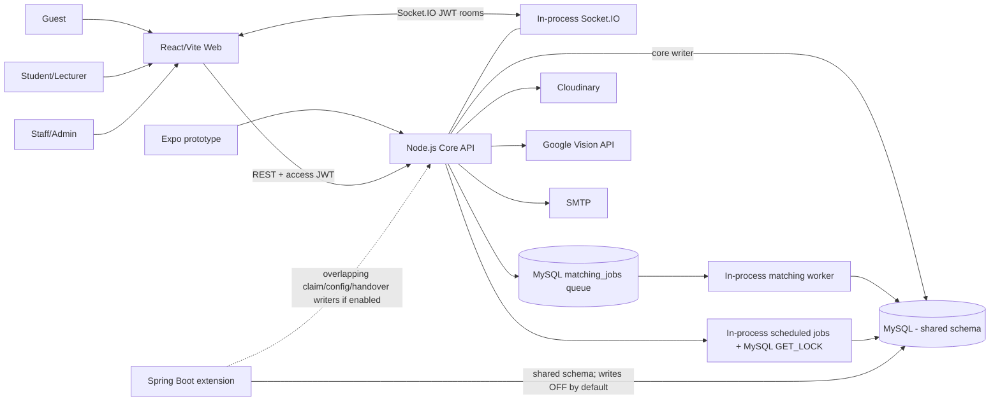

# Đánh giá độc lập FPTU Lost & Found System - 2026-07-13

> Phạm vi: working tree hiện tại trên nhánh `main`, gồm cả thay đổi chưa commit. Đây là báo cáo audit trước khi sửa lỗi, không phải xác nhận production-ready.

## Quy ước bằng chứng

| Ký hiệu | Ý nghĩa |
|---|---|
| **CV** | Đã xác minh bằng code theo chuỗi route -> middleware -> validator -> controller -> service -> repository -> migration. |
| **RV** | Đã chạy lệnh và ghi nhận kết quả trong phiên audit ngày 2026-07-13. |
| **SR** | Rủi ro từ static review; cần test khai thác/concurrency để xác nhận tác động runtime. |
| **UV** | Chưa thể kiểm chứng do thiếu server, Maven, API key hoặc môi trường tách biệt. |

## 1. Executive Summary

Project là một **modular monolith thực dụng trên Node.js** với React web, MySQL, Socket.IO và các adapter Cloudinary/SMTP/Google Vision. Spring Boot hiện là **business extension bị khóa ghi mặc định**, không phải một microservice production độc lập. Phạm vi nghiệp vụ rộng và tài liệu tốt, nhưng các invariant quan trọng ở claim, appointment và warehouse chưa được bảo vệ bằng transaction/constraint.

**Kết luận ngắn:**

- **Demo capstone:** Conditional Go. Có thể demo flow happy-path sau khi khóa các đường tắt trạng thái và chuẩn bị DB/demo script ổn định.
- **Pilot campus:** No-Go ở hiện tại. Bằng chứng media chưa thật sự private, hai claim có thể cùng accepted, appointment có thể tự duyệt/tự complete.
- **Production:** No-Go. Chưa có hardening privacy, concurrency, scale-out realtime, observability và load/security test.
- **Điểm MVP/Capstone:** **6.3/10 - Acceptable**.
- **Điểm Production:** **4.2/10 - High risk**.

Ba rủi ro lớn nhất:

1. Hai claimant khác nhau có thể cùng được chấp nhận cho một bài FOUND.
2. Một participant có thể tự tạo, tự accept và tự complete appointment; completion cũng có race làm cộng điểm lặp.
3. Full warehouse update có thể đi vòng qua policy dispose/donate/transfer và media “private” vẫn dùng public delivery URL.

### Repo, stack và lệnh có thể chạy

| Khu vực | Vai trò thực tế | Stack / bằng chứng |
|---|---|---|
| `apps/web` | Web client chinh | React 18, TypeScript, Vite, React Query, Socket.IO client; `App.tsx` 4,214 dong, `styles.css` 5,676 dong. |
| `apps/api-node` | Core API va writer chinh | Express, TypeScript, MySQL2, JWT, Socket.IO, Zod, Cloudinary, Google Vision. |
| `apps/mobile` | Expo prototype/MVP phu | React Native/Expo; typecheck pass, khong duoc xem la core production. |
| `apps/java-admin-service` | Java business extension | Spring Boot, JWT, JPA; writer bi chan mac dinh boi `WriteOwnershipConfig`. |
| `apps/api-node/src/migrations` | Source of truth schema | 24 migration da duoc smoke tren DB hien tai. |
| `.github/workflows` | CI co ban | Node/Web/Mobile build, isolated MySQL E2E, Java build. |

Lenh da chay: `npm run build:api`, `npm run build:web`, `npm run test:api`, `npm run typecheck:mobile`, `npm run smoke:migration`, `npm run scan:text`, `npm audit --omit=dev --audit-level=high`, `npm run build:java`, `git diff --check`.

## 2. Phạm vi và giới hạn đánh giá

- Audit doc source code va migration thuc te, khong tin mac dinh cac checkbox trong docs.
- API khong chay tai `localhost:3001`; khong chay E2E co ghi du lieu vao shared DB de tranh lam hong demo data.
- Maven khong co tren may, nen Java build la **UV**; CI co job Java nhung ket qua remote khong duoc gia dinh.
- Google Vision credential thieu; OCR that la **UV**, chi fallback/config scan duoc xac minh.
- Cloudinary config scan pass, nhung quyen delivery cua tenant ben ngoai la **UV**; code upload khong yeu cau `authenticated/private` nen privacy risk la **CV/SR**.
- Khong sua source, khong migrate, seed, commit hay push trong audit.
- Khong lap lai secret. Scan file tracked khong tim thay mau private key/Google key; credential tung xuat hien trong anh man hinh lich su van nen rotate.

## 3. Kiến trúc thực tế

### Runtime ownership và source of truth

| Domain | Owner runtime hien tai | Source of truth | Nhan xet |
|---|---|---|---|
| Auth/user/role | Node | `users`, `roles`, `refresh_tokens`, `otp_verifications` | Java chi doc JWT. |
| Post/search/media | Node | `posts`, `post_media`, `ai_tags` | Google Vision/Cloudinary la adapter. |
| Matching | Node worker | `match_results`, `matching_jobs`, config | Queue nam trong MySQL, co `SKIP LOCKED`. |
| Claim/evidence | Node | `claims`, `claim_evidence`, logs | Java co writer trung lap neu bat flag. |
| Appointment/chat | Node | `appointments`, `chat_messages` | Socket.IO chi la delivery, DB la truth. |
| Warehouse | Node | `warehouse_items` | Java handover dung bang khac/flow khac, co nguy co divergence. |
| Config | Node | `config_entries`, `config_history` | Java co extension config writer neu bat. |
| Realtime | Một Node process | DB + in-memory Socket.IO rooms | Không có Redis adapter. |

**Danh gia:** day khong phai microservices. Day la Node modular monolith co Java extension chia se database. `WriteOwnershipConfig.java` la mot guard tot, nhung khi `JAVA_WRITES_ENABLED=true` thi Node writers van mo; “one writer per flow” chua duoc thuc thi hai chieu.

## 4. Luồng nghiệp vụ thực tế

Bang sau tom tat chuoi code va invariant. “Hoan thien” danh gia theo MVP, khong phai production.

| # | Luong, actor, input | Xu ly va du lieu doc/ghi | Trang thai/quyen | Loi, race, luong thay the | Hoan thien |
|---:|---|---|---|---|---|
| 1 | Register/login/OTP/refresh/logout; Guest/User | Auth routes -> Zod -> `authService` -> user repo; ghi OTP, user, roles, refresh token | OTP pending->verified; refresh active->revoked | OTP consume va refresh rotation khong atomic; Google OAuth thieu state/PKCE; access token con song sau logout | 65% |
| 2 | Tao LOST; authenticated user | Validate post, hash secret, insert post/media, enqueue matching | `OPEN`; owner/admin sua | Daily config khong enforce; secret hash chua co luong compare; create/media khong cung transaction | 70% |
| 3 | Tao FOUND; authenticated user | Insert FOUND, optional handover/media, enqueue matching | `OPEN` | Post type co the doi sau tao; co the pha vo claims/matches | 75% |
| 4 | Upload media; owner | Multer memory -> MIME check -> Cloudinary -> Vision -> DB | Owner/admin; evidence route co access check | Trust MIME; partial upload orphan; SafeSearch chi luu, khong enforce; URL private chua private | 60% |
| 5 | Search/filter/feed; Guest/User | Fulltext neu co query, fallback LIKE; filters, pagination | Public fields; contact redaction | Can query plan/load test; accessibility card/filter kem | 80% |
| 6 | Matching; worker/Admin re-run | MySQL job -> all opposite OPEN posts -> TF-IDF + category/location/time/OCR/image signals -> tier -> upsert/notify | WEAK/SUGGESTION/NOTIFY/HIGH; khong auto return | Candidate scan lon; stale result; notified-before-notification; score khong phai ownership proof | 75% |
| 7 | Tạo claim; claimant | Chỉ FOUND, không self-claim, unique per claimant/post, evidence confidence | `PENDING` | Không có invariant một accepted claim/post; secret LOST không bind vào claim | 65% |
| 8 | Upload evidence; claimant/reviewer | Upload Cloudinary, OCR/labels, insert evidence, recalc confidence | Claim active; auth route | Public delivery URL; evidence can them theo policy nhung no transaction/cleanup | 60% |
| 9 | Review claim; owner/Staff/Admin | Read claim/evidence/confidence, accept/reject/more-info | Role/participant policy | “confidence” advisory dung; hai reviewer tren hai claims co the cung accept | 55% |
| 10 | Claim transitions | Repo conditional update mot row, append state log | PENDING/NEED_MORE_INFO -> ACCEPTED/REJECTED/CANCELLED | Log khong cung transaction; khong reject sibling claims; race test chi cung mot claim | 50% |
| 11 | Chat; accepted claim participants/reviewer | Socket room auth DB, persist message, emit event | Chi ACCEPTED theo policy | `is_read` toan cuc, khong per recipient; socket khong revalidate token; no distributed adapter/rate limit | 70% |
| 12 | Appointment; claim participants/Staff/Admin | Create/list/accept/reject/reschedule/complete/proof | PENDING -> ACCEPTED -> COMPLETED | Proposer co the tu accept; participant tu complete; multiple active; CAS thieu | 45% |
| 13 | Warehouse intake/lifecycle; Staff/Admin | CRUD, capacity, retention deadline, jobs | PENDING_APPROVAL/RECEIVED/STORED/CLAIMED/EXPIRED/terminal | Full PUT/create bypass disposition policy; capacity/status TOCTOU | 55% |
| 14 | Handover/return | Appointment complete updates related records/logs/reputation | Claim/post/warehouse can duoc resolve/returned | Completion race va self-complete; Java `returnItem` bypass claim/appointment neu bat | 40% |
| 15 | Notification/email | Persist notification, emit Socket.IO; SMTP best effort/reminder | Read/unread | Khong outbox/idempotency key; event co the mat/trung; SMTP runtime UV | 65% |
| 16 | Feedback/reputation | Feedback sau appointment; add reputation | One UI flow | Completion race co the cong diem lap; can unique reputation event | 55% |
| 17 | Retention/expiration/jobs | 15 phut; MySQL `GET_LOCK`; expire posts/warehouse, alert, reminder | Due -> EXPIRED | Warehouse job expire ca CLAIMED dang co active process; lock chi bao ve scheduler group | 70% |
| 18 | Admin moderation/report/config | Role middleware, CRUD, audit log/history | Staff read/warehouse; Admin config/users/report | Khong last-admin guard; config update/history khong transaction; audit sau commit co the mat | 65% |

### State machine và đường tắt

| Entity | State machine hien tai | Duong tat da xac minh |
|---|---|---|
| Post | OPEN/MATCHED/RESOLVED/CLOSED/EXPIRED/HIDDEN | Owner co the PATCH sang gan nhu bat ky status; update co the doi LOST/FOUND. |
| Claim | PENDING/NEED_MORE_INFO/ACCEPTED/REJECTED/CANCELLED | Hai claim khac nhau tren cung post co the cung ACCEPTED. |
| Appointment | PENDING/ACCEPTED/REJECTED/CANCELLED/COMPLETED | Proposer co the self-accept; participant co the self-complete; update khong CAS. |
| Warehouse item | PENDING_APPROVAL/RECEIVED/STORED/CLAIMED/RETURNED/EXPIRED/DISPOSED/DONATED/TRANSFERRED | PUT/create co the vao terminal status ma khong chay disposition guard. |
| Handover | Node gan voi appointment/warehouse; Java co handover flow rieng | Java return co the resolve post khong can accepted claim/appointment/proof neu writes bat. |
| Notification | Persisted + read flag | Khong outbox; realtime delivery khong bao dam, poll co the phuc hoi. |
| Match result | Tier + notified flag | Stale rows co the con; notified duoc set truoc khi notification tao thanh cong. |

## 5. Top 10 vấn đề nghiêm trọng nhất

1. **BUG-CLAIM-01 (Critical/P0):** hai claim khac nhau co the cung ACCEPTED cho mot post. `claim.service.ts::accept`, `claim.repository.ts::updateStatus`, migration unique chi `(post_id, claimant_id)`.
2. **BUG-APT-01 (Critical/P0):** participant co the tu accept va tu complete appointment. `appointment.service.ts::canUseClaim/accept/complete`.
3. **BUG-APT-02 (Critical/P0):** complete khong CAS/lock, co the complete va cong reputation hai lan. `appointment.repository.ts::complete`, `user.repository.ts::addReputation`.
4. **BUG-WH-01 (Critical/P0):** full warehouse update/create bypass policy terminal disposition. `admin.controller.ts` schemas, `admin.repository.ts::createWarehouseItem/updateWarehouseItem`.
5. **SEC-MEDIA-01 (High/P0):** evidence/chat/proof dat trong folder ten private nhung upload van public delivery URL. `cloudinary.service.ts::streamUpload`.
6. **SEC-AUTH-01 (High/P1):** refresh rotation insert token moi truoc, khong check old-token update; concurrent reuse tao hai token hop le. `auth.service.ts::refresh`, `user.repository.ts::rotateRefreshToken`.
7. **SEC-AUTH-02 (High/P1):** OTP validate/consume tach query, co the reuse khi concurrent. `auth.service.ts::validateOtp`, user repository OTP methods.
8. **BUG-POST-01 (High/P1):** owner co the chuyen status post tuy y va doi type sau tao, pha vo lifecycle. `post.service.ts::update/updateStatus`, `post.validator.ts`.
9. **ARCH-JAVA-01 (High/P1):** Java writer neu bat se trung owner voi Node; Java return bypass core verification. `WriteOwnershipConfig.java`, `HandoverService.java::returnItem`.
10. **PERF-MATCH-01 (High/P1 production):** moi job doc tat ca opposite OPEN posts va tinh TF-IDF trong memory; bottleneck tang nhanh theo data. `post.repository.ts::listOppositeOpenPosts`, `matching.service.ts::runForPost`.

## 6. Bug Register đầy đủ

### Bug chi tiết P0/P1

| ID | Nhom / muc do | Trang thai, file/function | Dieu kien va tai hien | Hien tai -> mong doi | Tac dong / root cause | Fix, regression test, effort |
|---|---|---|---|---|---|---|
| BUG-CLAIM-01 | Business/DB; Critical P0 | **CV**, `claim.service.ts::accept` 241+, `claim.repository.ts::updateStatus` 185+, `005_integrity_constraints.sql` | Tao 2 claims cua 2 users cho cung FOUND; accept dong thoi | Ca hai row co the ACCEPTED -> chi mot ownership allocation | Tra mot vat cho 2 nguoi; thieu invariant/lock theo post | Transaction `SELECT post FOR UPDATE`, unique accepted allocation, reject siblings; test 2-claim race; M |
| BUG-APT-01 | Auth/business; Critical P0 | **CV**, `appointment.service.ts::canUseClaim`, `accept` 185+, `complete` 262+ | Claimant tao appointment, goi accept va complete bang cung token | Tu duyet/tu xac nhan -> counterparty/Staff hoac dual confirmation | Bypass handover, tang reputation sai | Action-specific policy, completion proof/dual ack; E2E self-action denied; M |
| BUG-APT-02 | Concurrency; Critical P0 | **CV/SR**, `appointment.repository.ts::complete` 277+, `user.repository.ts::addReputation` 642+ | Hai request complete cung luc | Ca hai qua pre-check, co the ghi/log/cong diem lap -> idempotent exactly-once | Check nam ngoai transaction, UPDATE khong `status=ACCEPTED` | Row lock/CAS + unique reputation event/outbox; concurrency test; M |
| BUG-WH-01 | Business; Critical P0 | **CV**, `admin.controller.ts` warehouse schemas 56+, `admin.repository.ts::create/update` 1171+ | Staff PUT EXPIRED -> DONATED hoac create terminal item | Bo qua grace/doc/active claim check -> chi process endpoint duoc terminal | Thanh ly vat dang tranh chap | Loai terminal khoi CRUD schema/service; centralize guard; E2E bypass; S |
| SEC-MEDIA-01 | Privacy; High P0 | **CV/SR**, `cloudinary.service.ts::streamUpload` 64+ | Upload claim evidence/proof/chat image, lay `secure_url` | URL co kha nang public -> authenticated/signed delivery | Lo ID/hoa don/serial; folder name khong tao ACL | Authenticated assets/private storage, short-lived signed URL, revoke old asset; security test unauth URL; L |
| SEC-AUTH-01 | Auth/concurrency; High P1 | **CV/SR**, `auth.service.ts::refresh` 539+, `user.repository.ts::rotateRefreshToken` 473+ | Gui 2 refresh request cung token | Insert 2 replacement token, revoke old update thu hai 0 rows nhung commit -> mot winner | Token replay/family duplication | Lock/consume old first + check affectedRows + family reuse revoke; concurrency test; M |
| SEC-AUTH-02 | Auth/concurrency; High P1 | **CV/SR**, `auth.service.ts::validateOtp` 151+, OTP repo 359+ | Hai register/reset request cung OTP | Cung OTP co the duoc validate truoc khi mark used -> atomic consume | Reset/register lap | Transaction row lock, attempts/status CAS; concurrency/bruteforce tests; M |
| SEC-OAUTH-01 | Auth; High P1 | **CV**, `auth.service.ts::googleAuthorizationUrl` 199+, `auth.controller.ts::googleCallback` 86+ | Khoi tao Google login tu site/flow khac | Khong `state`/PKCE/nonce -> login CSRF/account confusion | OAuth flow thieu request binding | HttpOnly SameSite state cookie + PKCE/nonce; negative callback tests; M |
| BUG-POST-01 | Business; High P1 | **CV**, `post.service.ts::update/updateStatus` 267+, `post.validator.ts` | Owner PATCH RESOLVED/HIDDEN/MATCHED hoac PUT doi type | Arbitrary lifecycle/type -> explicit action transition | Claims/matches/warehouse khong dong bo | Cam doi type; transition matrix, system/staff-only resolve; E2E matrix; M |
| ARCH-JAVA-01 | Architecture/business; High P1 | **CV**, `WriteOwnershipConfig.java`, `HandoverService.java::returnItem` 99+ | Bat `JAVA_WRITES_ENABLED` khi Node van chay | Hai writer va Java resolve thieu invariant -> mot writer/flow | Divergence/race chung DB | Giu Java read-only/demo extension hoac tat Node routes tuong ung; contract tests; L |
| BUG-APT-03 | DB/business; High P1 | **CV/SR**, `appointment.repository.ts::create` 128+ | Tao/accept nhieu appointment tren mot claim | Nhieu active appointments -> mot active appointment/claim | Thieu unique active invariant; conflict TOCTOU | Allocation table/generated unique + transaction; race test; M |
| BUG-WH-02 | DB/concurrency; High P1 | **CV/SR**, `admin.repository.ts::assertWarehouseCapacityAllows/update` 332+, 1224+ | Hai Staff intake/update khi gan day capacity | Count-check-insert race, status update stale -> atomic capacity/CAS | Capacity vuot va transition sai | Transaction/row lock/counter, `WHERE status=?`; stress test; M |

### Register P2/P3

| ID | Severity/Priority/Status | Bang chung va dieu kien | Tac dong | Fix + test / effort |
|---|---|---|---|---|
| BUG-CLAIM-02 | Medium P2 **CV** | Claim create/status update va state log la cac statement tach roi trong `claim.repository.ts` | Audit trail co the thieu; `from_status` stale | Transactional state transition + log; fault-injection test / M |
| BUG-POST-02 | High P1 **CV** | LOST secret duoc hash trong `post.service.ts` nhung khong co code compare | Tinh nang secret verification khong thuc su xac minh claim | Thiet ke private signal comparison hoac bo wording/field; E2E / M |
| BUG-POST-03 | Medium P2 **CV** | Config `post.max_per_user_per_day` co trong migration nhung create khong enforce | Spam post, config UI gay hieu nham | Query count theo UTC/campus TZ va enforce; boundary tests / S |
| BUG-WH-03 | Medium P2 **CV** | `expireOverdueWarehouseItems` gom ca `CLAIMED` ma khong check active claim/appointment | Vat dang tra bi hien EXPIRED | Loai active workflow; scheduled-job test / S |
| BUG-MATCH-01 | Medium P2 **CV** | `runForPost` return som khi no candidate va khong xoa old result | Suggestion cu con sau close/delete | Reconcile/delete stale matches; lifecycle test / S |
| BUG-MATCH-02 | Medium P2 **CV/SR** | Mark notified truoc khi create notification trong `matching.service.ts` | Loi DB giua chung lam mat notify vinh vien | Transaction/outbox, retry/idempotency; injected failure test / M |
| SEC-UPLOAD-01 | Medium P2 **CV/SR** | `media.service.ts::assertImageFile` tin `file.mimetype`; no magic-byte/dimension policy | Fake file/decompression/resource abuse | Decode/sniff, pixel limit, SafeSearch quarantine; malicious corpus / M |
| BUG-UPLOAD-02 | Medium P2 **CV/SR** | Multi-file upload tung Cloudinary/DB item, no compensation | Partial failure tao orphan asset/half request | Saga cleanup/batch transaction; failure test / M |
| PRIV-VISION-01 | Medium P2 **CV** | Evidence/item URLs gui Google Vision | PII/serial/receipt xu ly ben thu ba | Consent, DPA, redact, disable OCR per evidence type; privacy test/doc / M |
| SEC-AUTH-03 | Medium P2 **CV** | Logout chi revoke refresh; middleware chi verify JWT | Access token dung toi 15 phut sau logout/role lock | Token version/status check cho action nhay cam; revocation test / M |
| SEC-AUTH-04 | Medium P2 **CV** | `locked_until`/`failed_login_count` co schema nhung login khong increment | Account lock policy khong hoat dong | Atomic failure counter/temporary lock; brute force test / M |
| SEC-AUTH-05 | Low P3 **CV** | Register OTP tra 409 neu email active | Email enumeration | Generic response + audit/rate limit; response parity test / S |
| SEC-RATE-01 | Medium P2 **CV/SR** | Rate limit in-memory theo IP, khong distributed/trust-proxy policy | Multi-instance bypass; campus NAT bi block chung | Redis/token bucket user+IP, proxy config; load test / M |
| RT-01 | High P1 production **CV** | Socket.IO in-process, no Redis adapter; JWT chi check connect | Scale-out mat event/room; expired token tiep tuc | Redis adapter, periodic/event auth, disconnect on role revoke; multi-node test / L |
| RT-02 | Medium P2 **CV** | `chat_messages.is_read` la mot flag chung; read update ca claim | Staff/doc mot lan lam tat ca recipient mat unread | Per-user receipt table; multi-recipient E2E / M |
| RT-03 | Medium P2 **CV/SR** | Notification no outbox/DB idempotency key | Crash/retry tao event mat/trung | Transactional outbox + unique event key; retry test / L |
| ADMIN-01 | High P1 **CV** | `updateUserStatus/updateUserRoles` khong chan self/last admin | Tu khoa/ha quyen admin cuoi | Transaction count active admins + guard; E2E / S |
| CONFIG-01 | Medium P2 **CV/SR** | Config update va history insert tach transaction | Config doi nhung history mat | Transaction/CAS/version; failure/concurrency test / M |
| UI-A11Y-01 | Medium P2 **CV** | Clickable `div/article` trong `BoardView.tsx`, `PostCard.tsx` khong keyboard semantics | Keyboard/screen-reader khong dung duoc | Button/link semantics, focus, axe test / S |
| UI-NAV-01 | Medium P2 **CV** | Admin tab/mode chu yeu local state, chi detail route co URL | Refresh/back mat context | URL route/search params cho admin flows; Playwright history test / M |
| DEP-01 | High P1 tooling **RV** | `npm audit --omit=dev`: 12 vulnerabilities, Vite high direct | Dev/build tool exposure; khong tu dong `--force` | Plan upgrade Vite/Expo, verify builds/E2E; M |

## 7. Security Review

### Điểm đã làm đúng

- **CV:** Express dùng Helmet và CORS allowlist trong `apps/api-node/src/app.ts`; development mới tự cho phép localhost.
- **CV:** SQL sử dụng placeholder của `mysql2`, không tìm thấy nối chuỗi input trực tiếp vào câu SQL. Các đoạn sort động được chọn từ allowlist.
- **CV:** Refresh token nằm trong HttpOnly cookie; access token của web ở memory, không lưu lâu dài trong localStorage.
- **CV:** Claim evidence/proof proxy đều yêu cầu JWT và kiểm tra participant/reviewer ở service.
- **CV:** Chat room kiểm tra quyền từ DB trước join/send; claim chưa accepted không được chat.
- **CV:** Zod được dùng ở route/controller cho phần lớn input quan trọng; password được hash bằng bcrypt.
- **RV:** Secret-pattern scan không phát hiện private key/Google key trong tracked files. Điều này không thay thế một secret scanner chuyên dụng.

### Khoảng trống cần xử lý

| Chủ đề | Đánh giá | Hành động |
|---|---|---|
| Claim/appointment authorization | P0: quyền “participant” đang dùng quá rộng cho accept/complete | Tách policy theo từng command, không dùng chung `canUseClaim`. |
| OAuth | Thiếu state, nonce/PKCE | Thêm one-time signed state cookie và PKCE. |
| Token revocation | Logout/disable không vô hiệu access JWT ngay | Token version hoặc DB check cho command nhạy cảm; giữ TTL ngắn. |
| CSRF | Refresh dùng cookie; SameSite giúp giảm rủi ro nhưng cần xác minh thuộc tính cookie và Origin | Enforce SameSite/secure/domain, Origin check cho refresh/logout. |
| Upload/privacy | MIME header không đáng tin; Cloudinary URL có thể public | Sniff/decode, signed private delivery, EXIF stripping, retention. |
| Rate limit | Map trong process theo IP | Redis-backed, user+IP key, `trust proxy` rõ ràng. |
| Realtime | Token chỉ xác minh lúc connect; no message throttling | Revalidate quyền/token, max payload, per-event limiter, Redis adapter. |
| Admin safety | Không last-admin guard | Không cho khóa/gỡ quyền admin active cuối cùng. |
| Enumeration | Register tiết lộ email tồn tại | Generic response; log nội bộ. |
| Audit | Một số audit write nằm sau commit chính | Transaction/outbox và append-only controls. |

Không phát hiện bằng chứng command injection/path traversal trong source đã đọc. Stored XSS được giảm bởi React escaping, nhưng mọi rich text/URL tương lai vẫn phải sanitize và allowlist scheme. SSRF hiện bị giới hạn vì Vision chủ yếu nhận URL do server vừa tạo; nếu API cho client truyền URL trực tiếp trong tương lai phải chặn private network/redirect.

## 8. Performance và Scalability Review

### Hiện trạng

- Matching đã chuyển sang **bất đồng bộ** qua bảng `matching_jobs`; worker claim batch bằng `FOR UPDATE SKIP LOCKED`, có retry. Đây là cải tiến đúng hướng.
- Candidate generation vẫn tải toàn bộ opposite `OPEN` posts, sau đó xây TF-IDF/tính score trong process và upsert tuần tự. Đây là hotspot CPU, memory và DB round-trip lớn nhất.
- Search dùng `MATCH ... AGAINST` khi có query và fallback `LIKE`; feed có `LIMIT/OFFSET`. Cần `EXPLAIN ANALYZE` trên dữ liệu thật để chứng minh index được dùng.
- Scheduled jobs có MySQL `GET_LOCK`, tránh hai scheduler chạy cùng lúc. Matching queue có row locking. Notification/reputation/disposition chưa có idempotency tương đương.
- Socket.IO và rate limit nằm trong memory một instance; không horizontal-scale đúng.
- Không có Redis/cache ngoài React Query client cache. Với campus MVP một instance có thể đủ, nhưng chưa có benchmark.

### Dự đoán bottleneck (inference, chưa benchmark)

| Quy mô | Dự đoán |
|---|---|
| 1.000 users | Một Node/MySQL instance có thể đáp ứng nếu active concurrency thấp; upload/Vision latency và shared DB connection là biến số chính. |
| 10.000 users | Offset pagination, notification polling, matching candidate scan và Socket.IO memory bắt đầu đáng kể; cần indexes/query plan và worker separation. |
| 100.000 posts | Full opposite-post scan cho mỗi matching job không chấp nhận được; TF-IDF memory/CPU và sequential upserts sẽ tạo backlog. |
| Nhiều claim đồng thời | Không chỉ chậm mà sai correctness do thiếu one-accepted-claim invariant. Phải sửa transaction trước load tuning. |

### Kế hoạch benchmark

| Hạng mục | Dataset / tải | Chỉ số | Ngưỡng MVP đề xuất |
|---|---|---|---|
| Feed/search | 100k posts, 20 categories, 50 locations; 50 VU | p50/p95/p99, RPS, error, DB time | p95 < 500 ms, p99 < 1 s, error < 1% |
| Create post | 10 VU, ảnh mock/Cloudinary stub | API latency, queue enqueue, failure rate | p95 < 800 ms không tính upload bên thứ ba |
| Matching | 10k/100k open candidates; 1/10 workers | duration/job, backlog age, CPU/RAM, DB query | p95 < 10 s ở bounded candidate set; backlog < 2 phút |
| Claim race | 20 concurrent claimants/reviewers cùng post | accepted count, deadlocks, p95 | Exactly 1 accepted; 0 duplicate reputation |
| Appointment complete | 20 requests cùng appointment | completion/log/reputation count | Exactly once |
| Warehouse intake | capacity-1 với 20 concurrent requests | active count, conflicts | Không vượt capacity |
| Socket | 1k/5k connections, room isolation | connect p95, event delay, memory, leak | p95 event < 500 ms; 0 cross-room event |
| Media proxy | 20 concurrent downloads | throughput, timeout, memory | Bounded memory; timeout/error rõ ràng |

Nên dùng k6/Artillery cho HTTP/Socket, seed generator có dữ liệu phân bố thật, MySQL slow query log và `EXPLAIN ANALYZE`. Không công bố capacity trước khi có số đo.

## 9. Code Quality Review

### 10 code smell ảnh hưởng cao

| # | Smell và bằng chứng | Hệ quả | Refactor thiết kế đề xuất |
|---:|---|---|---|
| 1 | `apps/web/src/App.tsx` 4,214 dòng | Coupling view/auth/admin/modal, khó test/team work | Tách app shell, route modules, auth/session provider, feature pages. |
| 2 | `apps/web/src/styles.css` 5,676 dòng | Cascade/override/responsive regression, nhiều `!important` | Tách token/base/layout và feature CSS modules; giữ visual snapshot. |
| 3 | `admin.repository.ts` hơn 1,500 dòng, nhiều bounded context | Repository thành service nghiệp vụ thứ hai | Tách user/category/location/warehouse/report/config repositories. |
| 4 | Post repository hơn 1,100 dòng | Search, CRUD, matching, media cùng một module | Tách PostWrite, PostQuery, MatchStore, MediaStore. |
| 5 | Authorization helper quá rộng (`canUseClaim`) | Dùng lại sai nghĩa cho create/accept/complete | Command policy riêng có actor/action/resource. |
| 6 | State transition ở service, read/update/log phân tán | TOCTOU và audit thiếu | Aggregate transaction methods hoặc command handler transactional. |
| 7 | Config chỉ validate primitive type | Threshold/weight có thể phi logic hoặc tổng sai | Registry typed theo key với range/cross-field validation/version. |
| 8 | In-memory scheduler/socket/rate limiter | Hành vi thay đổi khi scale process | Adapter interfaces; MySQL/Redis coordination tùy deployment. |
| 9 | Frontend navigation trộn URL và local state | Back/refresh không nhất quán | Router là source of truth cho page/tab/filter quan trọng. |
| 10 | Expo `App.tsx` 1,411 dòng/manual screens | Khó phát triển mobile thật | Hoãn theo scope; nếu tiếp tục thì Expo Router + feature screens. |

TypeScript nhìn chung có type ở domain chính nhưng vẫn có nhiều boundary kiểu `Record<string, unknown>` và mapping thủ công. Điều này không tự thân là bug, nhưng nên parse thành DTO cụ thể ngay tại controller và không truyền “unknown bag” sâu xuống service.

Error handler tập trung là điểm tốt; logging hiện dùng `console` và thiếu request/correlation ID, structured redaction, metrics/tracing. Không nên refactor toàn bộ trước defense; ưu tiên transaction/invariant trước việc chia file vì correctness quan trọng hơn thẩm mỹ kiến trúc.

## 10. Test và CI/CD Review

### Kết quả chạy thực tế

| Lệnh | Kết quả | Phân loại |
|---|---|---|
| `npm run build:api` | Pass | **RV** |
| `npm run build:web` | Pass; bundle JS 427.14 kB, gzip 123.33 kB | **RV** |
| `npm run test:api` | Pass 6/6 policy tests | **RV** |
| `npm run typecheck:mobile` | Pass | **RV**; không chứng minh runtime mobile |
| `npm run smoke:migration` | Pass, 24 migrations trên DB `fptu_lost_found` | **RV**; không phải blank-DB rebuild trong phiên này |
| `npm run scan:text` | Pass; cảnh báo thiếu Google Vision credential | **RV** |
| `npm run build:java` | Fail vì máy không có `mvn` | **UV môi trường**, chưa kết luận code fail |
| `npm audit --omit=dev` | 12 vulnerabilities: 1 high, 11 moderate | **RV** |
| `git diff --check` | Pass; chỉ warning line ending | **RV** |
| E2E DB/API | Không chạy vì API offline và DB hiện tại không được xác nhận là isolated test DB | **UV có chủ đích** |

CI thực tế tồn tại ở `.github/workflows`: build Node/Web, mobile typecheck, MySQL 8 isolated migrate/seed/E2E, Playwright và Java build. Tuy vậy dependency audit đang `continue-on-error`, chưa có coverage threshold, SAST/secret/container scan, deployment/rollback, metrics/tracing.

### Test matrix

| Module | Unit | Integration/E2E hiện có | Security | Concurrency | Thiếu chính | Ưu tiên |
|---|---|---|---|---|---|---|
| Auth/OTP/token | Không | Core flow script | Không | Không | OTP/refresh race, OAuth state, logout revoke, brute force | P0/P1 |
| Post/search | 3 policy tests | Core + role/privacy scripts | Một phần | Không | Status/type matrix, daily limit, query plan | P1 |
| Matching | Không | Core happy path | Không | Job locking gián tiếp | Scoring fixtures, stale cleanup, notify failure, load | P1 |
| Claim/evidence | 3 policy tests | Core, evidence, same-claim race scripts | Privacy script | Sai phạm vi | Two-claim race, private origin URL, audit atomicity | P0 |
| Chat/realtime | Policy test | Chat gating script | Room gating | Không | reconnect, expiry, room isolation multi-user/node, spam | P1 |
| Appointment | Không | Core happy path | Không | Không | Self-accept/complete, double complete, active uniqueness | P0 |
| Warehouse | Không | Lifecycle script | Role script | Không | PUT bypass, capacity race, active-claim expiry | P0 |
| Admin/config/report | Không | Admin CRUD script | Role script | Không | Last admin, rollback race/audit failure | P1 |
| Web | Không | 2 Playwright tests, một test login optional | Không | N/A | Critical journey, a11y, visual/responsive, error states | P1 |
| Java extension | Không tìm thấy | Không tìm thấy | Không | Không | Build local, contract/schema/write-ownership tests | P1 nếu demo Java |

Các E2E hiện tại chủ yếu là scripts chạy HTTP và có giá trị smoke, nhưng dễ tạo **false confidence**: `e2e-claim-race.ts` chỉ race accept/reject cùng một claim, không kiểm tra hai claims khác nhau cùng post; mobile typecheck không chứng minh navigation/upload trên device; migration smoke trên DB đã migrate không chứng minh blank DB.

## 11. UX và Product Review

| Persona | Điểm tốt | Rủi ro/ma sát | Ưu tiên |
|---|---|---|---|
| Guest | Feed/search và detail có route public | Một số clickable card/filter không dùng keyboard semantics | Sửa semantic HTML/focus. |
| Student/Lecturer mất đồ | Tạo LOST, gợi ý match, notification | Secret verification tạo kỳ vọng nhưng hiện chưa được compare; tier có thể bị hiểu là ownership | Đổi copy “gợi ý tương đồng”, giải thích score, không nói xác minh chủ sở hữu. |
| Người nhặt đồ | FOUND, handover point, upload ảnh | Chưa rõ privacy của ảnh/địa điểm và bước tiếp theo | Progressive disclosure; CTA bàn giao rõ. |
| Claimant | Evidence confidence/explanation là điểm khác CRUD | Private evidence URL risk; appointment có thể tự xác nhận | Khóa backend trước, copy “mức hỗ trợ review”, consent media. |
| Staff review | Có claim/evidence/warehouse/dashboard | Cần thấy conflict/sibling claims và audit; status hiện dễ lệch | Một review work queue thống nhất, warning invariant. |
| Staff warehouse | Intake/status/retention/export | PUT bypass policy, capacity race, CLAIMED bị expire | Chỉ expose commands hợp lệ theo state. |
| Admin | User/config/report/location CRUD khá rộng | Có thể tự khóa/loại admin cuối; dashboard chưa phải observability | Last-admin guard, confirmation và audit view. |
| Mobile user | Responsive web + Expo prototype | Native mobile chưa đủ bằng chứng runtime | Dùng responsive web làm core; hoãn native claim. |

**Quick wins:** sửa wording matching/evidence; vô hiệu button khi submit; semantic button/link; hiển thị “ai cần xác nhận tiếp theo”; ẩn command không hợp lệ theo state; empty/error retry rõ.

**Cần redesign:** claim-to-appointment work queue; dual-confirmation handover; evidence privacy/consent; dispute/appeal. Không tìm thấy flow appeal/dispute đầy đủ trong code (**CV thiếu**).

**Nên hoãn/bỏ khỏi core:** native mobile hoàn chỉnh, custom-trained AI/MLOps, PDF analytics sâu, production microservices. Matching là hybrid/rule-based + Google Vision assisted OCR; score không phải xác nhận sở hữu.

## 12. So sánh ba hướng kiến trúc

| Phương án | Ưu điểm | Nhược điểm/rủi ro | Migration, chi phí | Phù hợp |
|---|---|---|---|---|
| A. Giữ hiện tại, sửa tối thiểu | Ít thay đổi, giữ demo; Java read-only; tập trung P0 | God files/repository còn; debt tiếp tục | 1-2 sprint cho invariant/test; khóa Java writes | **Tốt nhất ngay trước defense** |
| B. Modular monolith rõ ràng | Một transaction boundary, module ownership/testability tốt; hợp team nhỏ | Refactor cần kỷ luật, nguy cơ regression nếu làm một lần | 2-4 sprint tăng dần: Auth/Post/Claim/Appointment/Warehouse modules; Java trở thành adapter hoặc tách khỏi runtime | **Khuyến nghị chiến lược** |
| C. Multi-service thật | Scale/deploy độc lập, Java có domain riêng hợp lệ | Distributed transaction, outbox, identity, contract, observability; quá sức campus MVP | 3-6+ tháng, cần broker/Redis/API contracts/ops | Không phù hợp hiện tại |

**Lựa chọn:** dùng **A ngay lập tức để ổn định**, sau đó tiến dần đến **B**. Không chọn C. Node tiếp tục là owner duy nhất của core flow; Java chỉ read-only/business extension cho đến khi có một bounded context thật sự được chuyển toàn bộ schema/API/writer và có contract test. Đây là cách dùng hai chuyên môn mà không tạo hai nguồn sự thật.

## 13. Bảng chấm điểm chi tiết

Công thức: `Tổng = Σ(điểm tiêu chí × trọng số)`. Hai cột dùng cùng trọng số nhưng chuẩn bằng chứng khác nhau: MVP chấp nhận vận hành một instance/campus demo; production yêu cầu concurrency, privacy, observability và scale được chứng minh.

| Tiêu chí | Trọng số | MVP /10 | Quy đổi MVP | Production /10 | Quy đổi Production | Bằng chứng cộng/trừ, rủi ro, việc để tăng 1 điểm | Tin cậy |
|---|---:|---:|---:|---:|---:|---|---|
| Business correctness | 12% | 6.5 | 0.780 | 4.5 | 0.540 | + Flow rộng; - claim/appointment/warehouse invariant P0. Tăng: sửa 3 P0 và test race. | High |
| Architecture | 10% | 7.0 | 0.700 | 4.5 | 0.450 | + Node owner, Java guard; - shared schema/duplicated writers, God modules. Tăng: one-writer enforcement + module boundary. | High |
| Security | 14% | 6.0 | 0.840 | 4.0 | 0.560 | + JWT, role guards, Helmet/CORS/Zod; - OAuth/refresh/OTP race, action policy sai. Tăng: auth concurrency/OAuth hardening. | High |
| Privacy/data protection | 7% | 5.5 | 0.385 | 3.5 | 0.245 | + evidence proxy access; - Cloudinary public delivery/Google Vision consent. Tăng: signed private asset + retention/privacy policy. | Medium |
| Code quality | 8% | 6.5 | 0.520 | 5.0 | 0.400 | + TypeScript/layers/error handling; - giant UI/repositories, mixed responsibilities. Tăng: extract transaction commands/modules. | High |
| Maintainability | 8% | 6.0 | 0.480 | 4.5 | 0.360 | + migrations/docs; - 4k/5k-line files and duplicated Java logic. Tăng: feature modules incrementally. | High |
| Testability/coverage | 9% | 6.5 | 0.585 | 3.5 | 0.315 | + CI + many smoke E2E scripts; - only 6 unit tests, critical races absent. Tăng: P0 integration/concurrency suite. | High |
| Performance | 7% | 6.5 | 0.455 | 4.5 | 0.315 | + pagination/fulltext/background queue; - all-candidate matching, no benchmark. Tăng: bounded candidates + k6/query plans. | Medium |
| Scalability | 6% | 5.0 | 0.300 | 3.0 | 0.180 | + MySQL queue/GET_LOCK; - local Socket/rate limit, no distributed cache. Tăng: Redis adapter/limiter after benchmark. | Medium |
| Reliability/concurrency | 6% | 5.0 | 0.300 | 3.0 | 0.180 | + some CAS/locks; - critical race and no outbox/idempotency. Tăng: DB invariants + transactional outbox. | High |
| UX/UI | 5% | 7.0 | 0.350 | 5.5 | 0.275 | + coherent web flows/responsive work; - a11y, state clarity, privacy wording. Tăng: critical journey/a11y pass. | Medium |
| Documentation | 4% | 8.5 | 0.340 | 7.0 | 0.280 | + scope/business/traceability extensive; - checklist can overstate code. Tăng: evidence links/status discipline. | High |
| DevOps/deployment | 4% | 7.0 | 0.280 | 3.5 | 0.140 | + CI, Docker, migration/seed; - no deploy/rollback/metrics, audit advisory. Tăng: staging pipeline + observability/backup drill. | Medium |
| **Tổng** | **100%** |  | **6.315** |  | **4.240** | Làm tròn một chữ số ở mục 14-15. |  |

## 14. Điểm tổng MVP/Capstone

**6.3/10 - Acceptable.**

Điểm này không thấp vì thiếu mobile hay custom AI; hai phần đó nằm ngoài core hợp lý. Điểm bị kéo xuống bởi correctness của flow trả đồ: hệ thống có nhiều module và happy path rõ, nhưng backend hiện cho phép bỏ qua một số bước xác minh. Sau khi sửa P0, thêm race tests và chuẩn bị isolated demo DB, mức **7.3-7.8** là thực tế mà không cần mở thêm feature.

## 15. Điểm tổng Production

**4.2/10 - High risk.**

Production score thấp do chưa bảo đảm one-owner/exactly-once, private evidence, distributed realtime/rate limit, monitoring/rollback/load test. Không nên dùng cụm “production-ready”. Wording đúng là **MVP-ready sau P0 fixes** hoặc **campus pilot candidate sau security/privacy hardening**.

## 16. Roadmap cải tiến

### Giai đoạn 0 - Trong 24 giờ

| Priority / owner | Việc, lý do, impact | Effort / dependency | Acceptance criteria và test | Rủi ro nếu bỏ qua |
|---|---|---|---|---|
| P0 Backend+QA | Chặn hai accepted claims/post | M; migration + transaction | 20 concurrent accepts, đúng 1 accepted; siblings rejected/blocked | Trả cùng vật cho nhiều người |
| P0 Backend+QA | Cấm self-accept/self-complete; complete exactly-once | M; policy + DB | Self action 403; 20 complete -> 1 log/1 reputation | Bypass verification/gian lận điểm |
| P0 Backend | Chặn terminal status khỏi warehouse create/PUT | S | Chỉ `/process` được disposition; active claim/appointment 409 | Thanh lý nhầm tài sản |
| P0 Security+Backend | Quyết định evidence delivery: tạm disable public-origin exposure hoặc chuyển signed private | M/L; Cloudinary config | Unauthenticated raw/proxy access denied; signed URL hết hạn | Lộ bằng chứng cá nhân |
| P1 Product | Sửa wording score thành “gợi ý/mức hỗ trợ review”, không ownership certainty | S | UI/docs không có claim “xác minh chắc chắn” | Judge/user hiểu sai AI |

### Giai đoạn 1 - Trước demo/release tiếp theo

| Priority / owner | Việc, lý do, impact | Effort / dependency | Acceptance criteria và test | Rủi ro nếu bỏ qua |
|---|---|---|---|---|
| P1 Backend+QA | OTP/refresh atomic rotation/consume, OAuth state+PKCE | M | Concurrency/replay/OAuth negative tests pass | Account/token abuse |
| P1 Backend | Post transition matrix; cấm đổi type; enforce daily limit | M | Role/state matrix pass; config thực sự có hiệu lực | Lifecycle lệch/config giả |
| P1 QA+DevOps | Blank DB migrate -> seed -> Node E2E -> Web E2E trên DB isolated | M | Một command/CI xanh, không đụng shared demo DB | Demo phụ thuộc dữ liệu rác |
| P1 Backend | Last-admin guard và config transaction/history | S/M | Không tự khóa admin cuối; rollback có audit atomic | Mất quản trị/audit |
| P1 Frontend+QA | Critical journey Playwright + accessibility basics | M | Login, create, match, claim, review, appointment, warehouse; axe critical = 0 | UI regression ngày bảo vệ |
| P1 DevOps | Upgrade Vite theo plan, không `npm audit fix --force` mù | M | Build/E2E pass; high runtime audit = 0 hoặc exception ghi rõ | Supply-chain/tooling risk |

### Giai đoạn 2 - Trong 1-2 sprint

| Priority / owner | Việc, lý do, impact | Effort / dependency | Acceptance criteria và test | Rủi ro nếu bỏ qua |
|---|---|---|---|---|
| P1 Backend | Bounded matching candidate query + batch upsert/stale reconcile | L; indexes/query plan | 100k benchmark đạt ngưỡng, no stale result | Queue backlog |
| P1 Backend | Transactional outbox/idempotency cho notification/reputation | L | Retry/crash không mất/trùng logical event | Event không tin cậy |
| P2 Backend | Per-user chat read receipt | M; migration | Staff đọc không xóa unread của participant khác | Badge sai |
| P2 Frontend | URL-driven admin route/tab/filter | M | Back/refresh giữ đúng context | Navigation khó đoán |
| P2 Team | Tách module dần theo bounded context, không big-bang | L | Mỗi extraction có contract/tests, build pass | God files tiếp tục tăng |

### Giai đoạn 3 - Trước public pilot campus

| Priority / owner | Việc, lý do, impact | Effort / dependency | Acceptance criteria và test | Rủi ro nếu bỏ qua |
|---|---|---|---|---|
| P1 Security/Product | Privacy policy, consent, retention/delete/export, Google/Cloudinary DPA review | L | Data map, retention jobs, user notice, access audit | Vi phạm riêng tư |
| P1 DevOps | Staging, backup/restore drill, structured logs/metrics/alerts | L | Restore RPO/RTO đo được; alert rehearsal | Không phục hồi sự cố |
| P1 QA | Load/security test theo benchmark plan | L | Báo cáo p95/p99/error/query/socket và remediation | Không biết capacity |
| P2 Product | Dispute/appeal và operational SOP | M | Case tranh chấp có owner/SLA/audit | Staff xử lý tùy ý |
| P2 Backend | Nếu cần multi-instance: Redis Socket adapter + distributed limiter | L | Multi-node room/reconnect/rate tests | Event/rate inconsistent |

### Giai đoạn 4 - Trước production thật

| Priority / owner | Việc, lý do, impact | Effort / dependency | Acceptance criteria và test | Rủi ro nếu bỏ qua |
|---|---|---|---|---|
| P1 DevOps/Security | Deployment/rollback, secret manager/rotation, SAST/SCA/container scan | XL | Automated gated release và rollback drill | Supply-chain/secret/deploy incident |
| P1 Architecture | Chốt modular monolith hoặc tách service có ownership/contract/outbox thật | XL | Không shared-table dual writer; contract tests | Distributed inconsistency |
| P1 SRE | HA DB, capacity plan, tracing, incident response | XL | SLO, dashboard, on-call/runbook, chaos/failover test | Downtime không quan sát |

### Impact-Effort

| Nhóm | Công việc |
|---|---|
| Quick wins | Warehouse endpoint guard, last-admin guard, wording, post type lock, semantic buttons. |
| Strategic improvements | Claim/appointment DB invariants, private media, auth atomicity, bounded matching. |
| Expensive but necessary | Outbox, privacy program, load/security test, staging/backup/observability. |
| Low-value hiện tại | Đổi toàn bộ CSS framework, chia mọi file chỉ để giảm line count, analytics PDF sâu. |
| Nên bỏ/hoãn | Native mobile production, custom AI training/MLOps, microservices thật trước khi core invariant ổn định. |

## 17. Danh sách việc nên ngừng làm

1. Ngừng mở thêm module trước khi claim/appointment/warehouse correctness được khóa.
2. Ngừng tick checklist theo UI tồn tại; chỉ tick khi có code path, negative test và runtime evidence phù hợp.
3. Ngừng gọi matching score là xác minh chủ sở hữu hoặc “custom AI model”.
4. Ngừng bật Java writes cùng Node trên cùng flow/shared tables.
5. Ngừng dùng shared Aiven DB cho destructive E2E/seed; tạo DB/schema riêng theo môi trường hoặc ephemeral CI MySQL.
6. Ngừng đưa terminal warehouse status vào generic CRUD.
7. Ngừng refactor big-bang `App.tsx/styles.css` trước khi có critical journey tests.
8. Ngừng chạy `npm audit fix --force` không có upgrade plan vì có breaking Vite/Expo changes.
9. Ngừng quảng cáo mobile, production microservices, load capacity khi chưa có runtime evidence.
10. Ngừng dùng tên folder “private” như một security control.

## 18. Kết luận Go / Conditional Go / No-Go

| Mục tiêu | Quyết định | Điều kiện |
|---|---|---|
| Demo bảo vệ | **Conditional Go** | Sửa 4 P0, dùng isolated demo DB/seed, chạy core/roles/warehouse/claim/appointment web E2E và rehearsal. |
| Pilot FPTU | **No-Go hiện tại** | Cần private evidence, auth/concurrency hardening, dispute/SOP, privacy/retention, monitoring/backup và load test. |
| Production | **No-Go** | Cần toàn bộ pilot controls cộng HA, rollback, secret management, outbox/idempotency, multi-instance strategy. |

**Ba vấn đề lớn nhất:** one-accepted-claim chưa bảo đảm; appointment/handover có thể self-approve và race; evidence privacy/warehouse disposition chưa có control đủ mạnh.

**Hướng kiến trúc:** tiếp tục Node modular monolith làm core, Java read-only/business extension. Ổn định theo phương án A rồi refactor tăng dần sang B; không chuyển sang microservices thật lúc này.

**Việc đầu tiên nhóm phải làm ngày mai:** viết một migration/transaction design cho invariant “mỗi FOUND post chỉ có một accepted owner allocation”, rồi thêm test đồng thời hai claimants trước khi sửa UI hoặc mở feature mới.

---

### Dấu vết lệnh audit

- Commit nền: `3bf7fa1`; working tree có nhiều thay đổi trước audit và được giữ nguyên.
- API/Web/Mobile TypeScript build-check: pass.
- Node policy test: 6/6 pass.
- Migration smoke: 24 migrations pass trên DB hiện tại.
- Text/config scan: pass; Google Vision credential missing warning.
- Java: chưa xác minh do thiếu Maven local.
- API runtime/E2E: chưa xác minh trong phiên vì API offline và không dùng shared DB cho destructive test.
- Dependency audit: 1 high, 11 moderate; cần upgrade có kiểm soát.
- `git diff --check`: pass.
