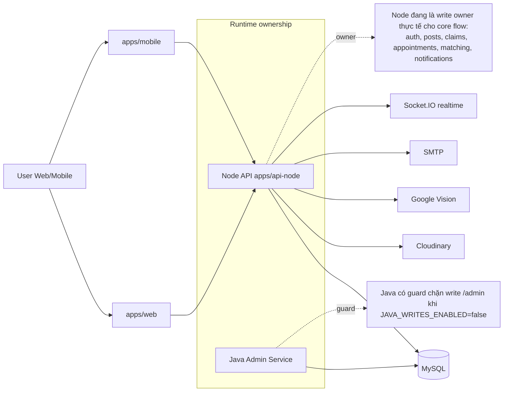
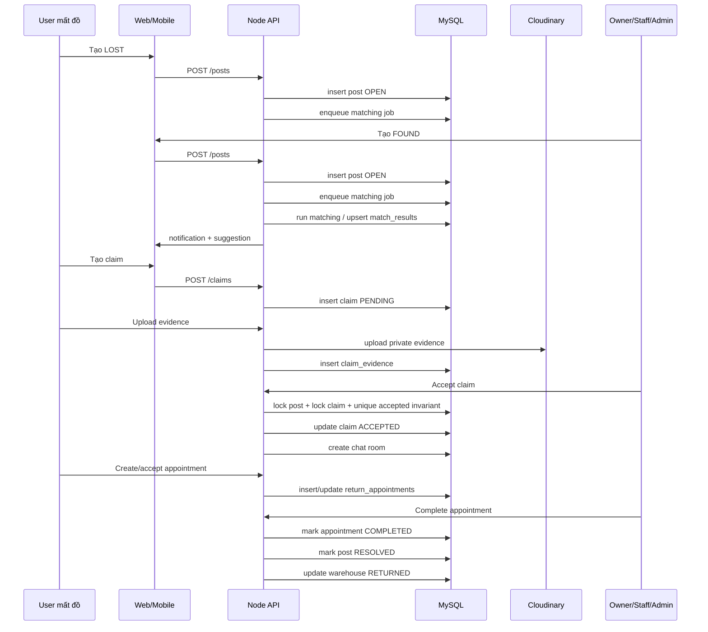
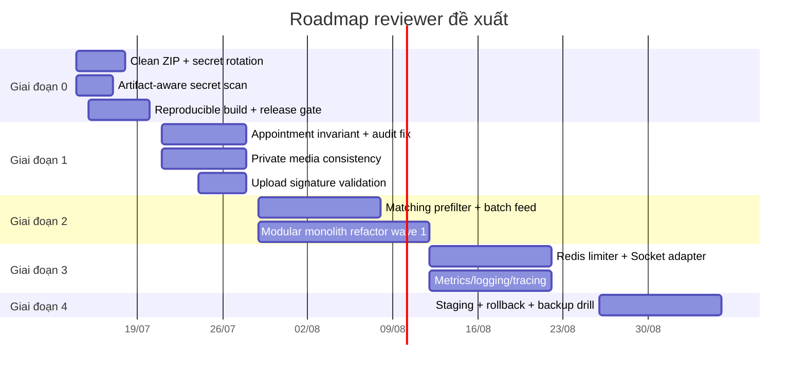

# Đánh giá lại FPTU Lost & Found System sau cải thiện

## Cập nhật triển khai trên working tree - 2026-07-15

Phần đánh giá bên dưới được tạo từ một ZIP cũ và vẫn hữu ích như bug register. Sau khi đối chiếu lại repository thật, các mục sau đã được triển khai. Trạng thái “đã sửa” ở đây nghĩa là đã có code/migration/test tương ứng; migration 024-025 vẫn phải được chạy trên MySQL cô lập và qua CI trước khi áp dụng vào shared demo DB.

| ID | Trạng thái mới | Bằng chứng triển khai |
| --- | --- | --- |
| BUG-01 | Đã giảm thiểu | `npm run package:release` chỉ tạo ZIP từ clean `HEAD` bằng `git archive`; không lấy `.env`, `.git`, dependency hoặc build output. Vẫn phải rotate secret từng xuất hiện trong ảnh/ZIP cũ. |
| BUG-02 | Đã sửa | `scan:secrets` tiếp tục kiểm tra tracked release input; `scan:secrets:workspace` cho phép audit cả file ignored trước khi chia sẻ raw working copy. CI kiểm tra quy trình package. |
| BUG-03 | Đã sửa, chờ DB E2E | Migration 024 thêm unique generated key; repository khóa claim bằng transaction; `e2e:core` yêu cầu lịch active thứ hai trả `409`. |
| BUG-04 | Đã sửa phần correctness/audit | Complete dùng row lock, chỉ transition một lần và ghi `actor_id` là người thực hiện thật. Proof vẫn là tùy chọn theo policy MVP, không được dùng như xác minh sở hữu tự động. |
| BUG-05 | Đã sửa | Appointment proof dùng `cloudinaryService.downloadTrustedImage`, có trusted-host, content-type, timeout và size guard. |
| BUG-06 | Đã sửa | Chat DTO/socket/history không trả `mediaUrl`; client chỉ dùng `mediaPublicId` qua authenticated proxy endpoint. |
| BUG-07 | Đã sửa | Upload kiểm tra magic bytes JPEG/PNG/WEBP; unit test chặn MIME giả và MIME/signature không khớp. |
| BUG-08 | Đã sửa | Chỉ tăng view sau khi bài tồn tại và actor được phép xem bài hidden. |
| BUG-09 | Đã sửa | Legacy verify OTP nhận `accountType` STUDENT/LECTURER; Swagger đã cập nhật. |
| BUG-10 | Future hardening | In-memory limiter phù hợp một instance MVP; Redis chỉ cần khi scale nhiều instance. |
| BUG-11 | Đã sửa | Suggestion feed batch-load match/post/config thay vì lặp query và build theo từng LOST post. |
| BUG-12 | Đã sửa cho MVP scale | SQL prefilter có candidate limit/time window cấu hình, ưu tiên category/building/time và index hỗ trợ; load benchmark lớn vẫn là future hardening. |
| BUG-13 | Đã sửa | API build dùng `tsc -p tsconfig.json`; build API và web đều pass trên working tree ngày 2026-07-15. |

Kiểm chứng đã chạy sau patch: `npm run build:api` pass, `npm run build:web` pass, `npm run test:api` pass 20/20, `npm run scan:secrets` pass và `git diff --check` pass. Chưa tick runtime migration/E2E vì không tự ý mutate shared DB.

## Executive Summary

### Lệnh thực tế để build, test, run và tạo ZIP sạch

Bên dưới là các lệnh thực tế có trong `package.json` và khuyến nghị dùng ngay khi xác minh bản release hiện tại. Các script gốc nằm ở `package.json:6-47`, `apps/api-node/package.json:6-25`, `apps/web/package.json:6-12`, `apps/mobile/package.json:6-12`.

| Mục | Lệnh | Nguồn script | Trạng thái khi tôi kiểm tra |
|---|---|---|---|
| Chạy API | `npm run dev:api` | `package.json:10`, `apps/api-node/package.json:7` | **Không chạy thử** vì cần dependency + DB + env đầy đủ |
| Chạy Web | `npm run dev:web` | `package.json:9`, `apps/web/package.json:7` | **Không chạy thử** vì thiếu dependency frontend trong artifact hiện tại |
| Chạy Mobile | `npm run dev:mobile` | `package.json:11`, `apps/mobile/package.json:7` | **Không chạy thử** |
| Build API | `npm run build:api` | `package.json:36`, `apps/api-node/package.json:24` | **Fail khi rerun**: thiếu `root node_modules/typescript/bin/tsc` |
| Build Web | `npm run build:web` | `package.json:35`, `apps/web/package.json:8` | **Chưa rerun trọn vẹn** vì chuỗi `quality:release` dừng ở API build; lint web rerun fail vì thiếu package/types |
| Typecheck Mobile | `npm run typecheck:mobile` | `package.json:38`, `apps/mobile/package.json:12` | **Fail khi rerun**: thiếu type/package (`socket.io-client`, Node test types) |
| Test API policy | `npm run test:api` | `package.json:29`, `apps/api-node/package.json:22` | **Chưa rerun** vì thiếu toolchain hoisted |
| Test Mobile | `npm run test:mobile` | `package.json:30`, `apps/mobile/package.json:11` | **Fail khi rerun**: `tsx` không có trong PATH artifact hiện tại |
| Migrate DB | `npm run migrate:api` | `package.json:25`, `apps/api-node/package.json:23` | **Không chạy** vì thiếu DB isolate và toolchain |
| Smoke migration | `npm run smoke:migration` | `package.json:28`, `apps/api-node/package.json:21` | **Không chạy** vì thiếu DB isolate |
| Secret scan | `npm run scan:secrets` | `package.json:40` | **Pass** |
| Release text scan | `npm run scan:text` | `package.json:41` | **Pass**, có cảnh báo thiếu Google Vision |
| Release gate tổng | `npm run quality:release` | `package.json:42` | **Fail** ở bước `build:api` |

Kết quả chạy thực tế trong sandbox:

```bash
$ npm run scan:secrets
Secret scan passed for 209 tracked file(s).

$ npm run scan:text
Cloudinary config check passed.
Release warning: Google Vision credentials are missing. OCR/tagging may use fallback behavior.
Release text scan passed.

$ npm run quality:release
...
> @lnfs/api-node@0.1.0 build
> node ../../node_modules/typescript/bin/tsc -p tsconfig.json
Error: Cannot find module '/mnt/data/review4/fptu-lost-found-system/node_modules/typescript/bin/tsc'
```

Checklist ngắn để tạo **release-safe ZIP** từ repo hiện tại:

```bash
git status --ignored -s
git archive --format=zip --output ../fptu-lost-found-system-clean.zip HEAD
unzip -l ../fptu-lost-found-system-clean.zip | egrep '(^|/)(\.git|\.env|node_modules|dist|target|playwright-results|test-results)/' && echo UNSAFE || echo SAFE
```

Nếu cần đóng gói **working copy hiện tại** thay vì `HEAD`, nên tạo thư mục staging rồi nén với allowlist/exclude list, tối thiểu phải loại `.git`, `.env`, `node_modules`, `dist`, `target`, `playwright-results`, `test-results`; việc này đặc biệt quan trọng vì `.gitignore:1-14` đã khai báo các thư mục này là không nên đi vào artifact, nhưng ZIP hiện tại vẫn chứa chúng.

### Kết luận ngắn

Bản cải thiện hiện tại **đã sửa được phần lớn các P0/P1 quan trọng ở tầng code**, đặc biệt là: bảo vệ `claim.secretAnswer` bằng hash thay vì plaintext, chặn đọc match/explanation cho user không liên quan, thêm transaction + row lock cho invariant “mỗi FOUND post chỉ có một accepted claim”, validate “trạng thái cuối” khi update post, gom state machine status post về một policy, proxy hóa ảnh private của claim evidence, và thêm cơ chế single-flight cho mobile refresh. Những thay đổi này hiện diện rõ ở `apps/api-node/src/services/claim-secret.service.ts:15-20`, `apps/api-node/src/services/claim.service.ts:131-143`, `apps/api-node/src/repositories/claim.repository.ts:120-126,270-353`, `apps/api-node/src/policies/post-match.policy.ts:3-5`, `apps/api-node/src/services/post.service.ts:255-299`, `apps/api-node/src/validators/post.validator.ts:34-79`, `apps/api-node/src/policies/post-state.policy.ts:7-44`, `apps/api-node/src/controllers/media.controller.ts:59-67`, `apps/api-node/src/services/media.service.ts:264-279`, `apps/mobile/src/single-flight.ts:1-12`, `apps/mobile/src/single-flight.test.ts:5-24`, cùng workflow CI tại `.github/workflows/ci.yml:26-45,123-131`.

Tuy vậy, **artifact release hiện tại chưa an toàn để phát hành**. ZIP đang chứa `.env`, `.git`, `node_modules`, `dist`, `target`, `playwright-results`, `test-results`; riêng `.git` khoảng 13 MB, `apps/mobile/node_modules` khoảng 79 MB, `apps/web/node_modules` khoảng 8.5 MB. Điều này đi ngược với `.gitignore:1-14` và làm lộ rủi ro secret/history/reproducibility. Ngoài ra, `scripts/secret-scan.mjs:6-12` chỉ quét `git ls-files`, nên **không quét file ignored**; vì vậy `.env` trong ZIP vẫn lọt qua secret gate. Khi tôi rerun `quality:release`, bước build API fail ngay do script build phụ thuộc `../../node_modules/typescript/bin/tsc` (`apps/api-node/package.json:24`), cho thấy release artifact hiện tại **không self-reproducible**.

Phán quyết reviewer của tôi là:

- **MVP / demo có kiểm soát:** **Conditional Go**
- **Artifact release hiện tại:** **No-Go**
- **Production:** **No-Go**

Ba việc cần làm đầu tiên, theo thứ tự, là: đóng gói lại artifact sạch; sửa các bug còn lại ở appointment/privacy/reproducibility; rồi mới rerun full build-test-e2e trên môi trường sạch.

## Phạm vi và giới hạn đánh giá

Tôi đánh giá dựa trên mã nguồn trong ZIP `fptu-lost-found-system(4).zip`, giải nén tại `/mnt/data/review4/fptu-lost-found-system`, kết hợp đọc code, migration, workflow CI và rerun một số script an toàn có sẵn trong `package.json`. Tôi **không tự thêm network call ra ngoài**, **không cài dependency mới**, và **không tự dựng DB từ internet**. Vì thế, mọi nhận xét bên dưới đều được gắn một trong bốn mức:

| Nhãn | Ý nghĩa |
|---|---|
| **Verified by code** | Xác minh trực tiếp từ source, migration, workflow, line refs |
| **Verified by run** | Đã chạy command/script trong sandbox và có output thực tế |
| **Potential risk** | Rủi ro suy ra chắc chắn từ thiết kế hiện tại nhưng chưa replay đủ full flow |
| **Untestable due to missing env** | Muốn xác minh runtime cần DB/API key/dependency/isolated infra mà sandbox hiện không có hoặc không nên dùng |

Giới hạn quan trọng nhất của đợt review này:

| Hạng mục thiếu | Ảnh hưởng |
|---|---|
| **Root dependency set không đầy đủ trong artifact** | `npm run quality:release` fail ở build API; mobile/web typecheck không tái lập sạch |
| **Không dùng DB thật / DB isolate của dự án** | Không rerun migration smoke, seed, e2e core/race/media/chat/admin theo runtime thật |
| **Không dùng Cloudinary / Google Vision / SMTP / Google OAuth thật** | Chỉ xác minh được flow bằng code và policy; không xác minh side effect bên ngoài |
| **Artifact chứa `.env` thật** | Tôi chỉ nêu vị trí và loại secret, không in giá trị |

Về mặt môi trường, Node, npm và Java có sẵn trong sandbox; Maven thì không có. Điều này khớp với ghi chú ở `CODEX_IMPLEMENTATION_PLAN.md:146-153` rằng local Java build không phải verification owner chính; nhưng với reviewer độc lập, điều đó cũng có nghĩa là **bản ZIP hiện tại không đủ bằng chứng runtime end-to-end cho Java artifact**.

## Khảo sát repo và kiểm chứng P0/P1

### Khảo sát repo

Repository hiện là **npm workspaces monorepo**, không dùng pnpm/turbo. Cấu hình workspace nằm ở `package.json:44-47`. Các thành phần chính:

| Thành phần | Vai trò | Bằng chứng |
|---|---|---|
| `apps/api-node` | Core write API Node/Express/TypeScript/MySQL/Socket.IO | `apps/api-node/package.json:1-55`, `apps/api-node/src/server.ts:9-26` |
| `apps/web` | Frontend React/Vite/TypeScript | `apps/web/package.json:1-32` |
| `apps/mobile` | Expo mobile prototype | `apps/mobile/package.json:1-30` |
| `apps/java-admin-service` | Java/Spring admin extension, write bị guard mặc định | `apps/java-admin-service/src/main/java/vn/edu/fpt/lnfs/config/WriteOwnershipConfig.java:14-49`, `apps/java-admin-service/src/main/resources/application.yml:20-23` |
| `apps/api-node/src/migrations` | 23 migration SQL + runner | danh sách `001` đến `023` |
| `.github/workflows/ci.yml` | CI chạy scan/build/test + e2e + playwright + Java build | `.github/workflows/ci.yml:26-45,52-61,88,112,123-131` |

Git state của artifact hiện tại là **dirty**, không phải snapshot sạch để release. `git status --ignored --short` cho thấy nhiều file `M`, nhiều file `??`, và các payload ignored như `!! .env`, `!! apps/api-node/dist/`, `!! apps/mobile/node_modules/`, `!! apps/web/dist/`, `!! apps/java-admin-service/target/`, `!! apps/web/playwright-results/`.

### Kiến trúc hiện tại



Nhận định: đây **chưa phải microservices thật**, mà là một monolith Node có xu hướng modular hóa dần, cộng với một Java extension cùng dùng chung schema. Việc chặn Java write mặc định là đúng hướng (`WriteOwnershipConfig.java:18-25,36-49`), nhưng shared schema vẫn tạo nợ kiến trúc dài hạn.

### Kiểm chứng P0/P1

| Mục | Trạng thái | Đánh giá reviewer | Bằng chứng chính |
|---|---|---|---|
| **P0-01 Secret hygiene** | **Partial** | Code scan có thêm, nhưng artifact release vẫn **không đạt** | `scripts/secret-scan.mjs:6-12,13-28`; `.gitignore:1-14`; ZIP vẫn chứa `.env`, `.git`, `node_modules`, `dist`, `target` |
| **P0-02 Protect claim secretAnswer** | **Verified by code** | Đã sửa đúng hướng | `022_claim_secret_privacy.sql:1-38`; `claim-secret.service.ts:15-20`; `claim.service.ts:131-143`; `claim.repository.ts:128-166`; `claim-secret.policy.test.ts:6-17` |
| **P0-03 Authorize match/explanation reads** | **Verified by code** | Đã fix đúng | `post-match.policy.ts:3-5`; `post.service.ts:255-275`; `post-match.policy.test.ts:7-15` |
| **P0-04 One accepted claim per FOUND post** | **Verified by code** | Đã có cả lock transaction lẫn unique surrogate | `023_one_accepted_claim_per_post.sql:1-6`; `claim.repository.ts:270-353`; `e2e-claim-race.ts:99-130` |
| **P1-01 Validate final merged post state** | **Verified by code** | Đã sửa đúng lỗi partial-update trước đây | `post.validator.ts:34-79`; `post.service.ts:312-347`; `post-final-state.policy.test.ts:20-53` |
| **P1-02 Centralize post status state machine** | **Verified by code** | Đã có rule rõ cho owner/admin | `post-state.policy.ts:7-44`; `post.service.ts:358-376`; `post-state.policy.test.ts:10-39` |
| **P1-03 Remove raw private evidence URLs** | **Verified by code, nhưng chưa phủ hết private media** | Claim evidence đã proxy đúng; claim chat image thì vẫn còn raw URL trong socket/history | Claim evidence: `claim.repository.ts:175-195`, `media.controller.ts:59-67`; Counterexample chat: `chat.repository.ts:36-51,146-160`, `realtime.service.ts:109-117` |
| **P1-04 Mobile refresh single-flight** | **Verified by code; untestable runtime trong artifact** | Code đúng ý tưởng; local typecheck/test không tái chạy sạch từ ZIP này | `apps/mobile/src/single-flight.ts:1-12`; `apps/mobile/src/api.ts:354-385`; `apps/mobile/src/single-flight.test.ts:5-24` |
| **P1-05 Media privacy gate trong CI** | **Verified by code** | Workflow có gọi e2e này | `.github/workflows/ci.yml:123-129`; `e2e-media-privacy.ts` |
| **P1-06 Multi-claim race gate trong CI** | **Verified by code** | Workflow có gọi e2e race thật | `.github/workflows/ci.yml:123-127`; `e2e-claim-race.ts:99-130` |

Nhận xét quan trọng nhất ở đây là: **P0/P1 logic business đã tiến bộ rõ rệt**, nhưng **P0-01 ở tầng packaging/release vẫn đang fail**. Tức là “code an toàn hơn” nhưng “artifact phát hành” chưa an toàn tương ứng.

## Đánh giá luồng nghiệp vụ và bug register

### Luồng nghiệp vụ chính

| Luồng | Actor | Input chính | Đọc/Ghi dữ liệu | Trạng thái trước/sau | Permission | Nhận xét reviewer |
|---|---|---|---|---|---|---|
| **Đăng ký / OTP** | Guest | email, otp, password, accountType | đọc `users`, `email_otps`; ghi user, role, otp status, refresh tokens | `PENDING_EMAIL_VERIFICATION -> ACTIVE` | public + rate limit | Logic đăng ký đã đầy đủ hơn; tuy nhiên endpoint `verifyOtp` vẫn hardcode gán thêm role `STUDENT` (`auth.service.ts:395-408`), không khớp với `accountType` ở `register` (`auth.service.ts:304-388`) |
| **Tạo LOST / FOUND** | Auth user | type, title, description, location, contact, secretVerification | đọc config + reference tables; ghi `posts` | tạo `OPEN`; LOST buộc secret; FOUND buộc holding location | owner tạo bài | Sau cải thiện, invariant create/update khá chắc (`post.validator.ts:34-79`, `post.service.ts:157-195,301-355`) |
| **Upload media** | Owner/Admin | item images, evidenceImages | đọc config + post owner; ghi `post_media`, `ai_tags`, logs | media tăng; enqueue matching | owner/admin | Kiểm soát format/size/count có, nhưng hiện mới dựa vào MIME/type chứ chưa sniff magic bytes (`media.service.ts:35-54`) |
| **Matching** | System/Admin | postId | đọc opposite open posts + ai tags + config; ghi `match_results`, notifications, matching_jobs | `OPEN/MATCHED` giữ nguyên; có thể auto-mark matched nếu config bật | owner/staff/admin được xem; admin rerun | Logic matching giàu tín hiệu hơn trước; nhưng candidate generation vẫn quét toàn bộ opposite posts (`post.repository.ts:722-750`, `matching.service.ts:487-545`) |
| **Claim** | Claimant / owner / staff / admin | postId, secretAnswer, location, description | đọc post; ghi `claims`, `claim_state_logs`, notifications | `PENDING -> NEED_MORE_INFO / ACCEPTED / REJECTED / CANCELLED` | claimant tạo; owner/staff/admin review | P0 lớn đã fix: secret hash + one accepted claim transaction (`claim.service.ts:112-165`, `claim.repository.ts:270-353`) |
| **Evidence** | Claimant upload; owner/staff/admin xem | image + evidenceType | ghi `claim_evidence`; xem qua proxy path | chỉ upload ở `PENDING/NEED_MORE_INFO` | claimant-only upload; authorized view | Claim evidence proxy tốt (`claim.repository.ts:187-194`, `media.controller.ts:59-67`), nhưng OCR bị nhập vào `description` nên vẫn có metadata leakage có chủ đích (`media.service.ts:68-77,239-248`) |
| **Review claim + verification score** | owner/staff/admin | claimId | đọc claim, post, matches; không auto-write ownership | score tham khảo | reviewer only | Score đã được đặt đúng vai: “tham khảo, không xác minh sở hữu” (`claim.service.ts:377-400`) |
| **Handover / appointment** | claimant, owner, staff, admin | claimId, proposedAt, handoverPoint/customLocation | đọc claim/point/conflict; ghi `return_appointments`, notifications | `PENDING/RESCHEDULED -> ACCEPTED/REJECTED/CANCELLED/COMPLETED` | các bên claim + staff/admin | Flow khá đầy đủ, nhưng còn lỗ hổng duplicate active appointment cùng claim và completion/audit chưa đủ chặt |
| **Notification / chat** | authenticated claim participants | claimId, message, image publicId | ghi `notifications`, `chat_rooms`, `chat_messages` | chat chỉ dùng khi claim `ACCEPTED` | claimant/owner/staff/admin theo role | Claim chat gating tốt (`claim-chat.policy.ts:16-18`, `realtime.service.ts:48-141`), nhưng message image hiện vẫn mang raw `mediaUrl` nội bộ qua socket/history |
| **Retention / warehouse / admin** | staff/admin | warehouse item, report, config, handover point | đọc/ghi nhiều bảng admin | warehouse lifecycle rõ hơn | staff/admin; nhiều route admin-only | Flow admin rất rộng, có safeguard retention/capacity (`admin.repository.ts:283-457,1171-1360`), nhưng vẫn còn debt lớn về module boundary và release discipline |

### Luồng chính end-to-end



### Bug register

Tôi giữ cách nhóm A–G hợp lý cho review này: **A business logic, B authorization/privacy, C data integrity, D concurrency, E performance, F maintainability/architecture, G QA/ops**.

| ID | Title | Group | Severity | Priority | Status | File + function | Reproduction steps | Impact | Root cause | Fix suggestion | Regression tests | Effort |
|---|---|---|---|---|---|---|---|---|---|---|---|---|
| **BUG-01** | Artifact release vẫn chứa `.env`, `.git`, `node_modules`, `dist`, `target` | B/G | Critical | P0 | **Confirmed** | `.gitignore:1-14`; ZIP listing; `git status --ignored --short` | Mở ZIP hiện tại, kiểm tra root và artifact folders | Lộ secret, lộ git history, artifact bẩn, khó audit | Quy trình đóng gói không dùng clean allowlist | Dùng `git archive` hoặc staging dir bằng exclude list; rotate secrets nếu `.env` là thật | Packaging test + `unzip -l` gate | S |
| **BUG-02** | Secret scan chỉ quét tracked files nên bỏ lọt `.env` ignored | B/G | High | P0 | **Confirmed** | `scripts/secret-scan.mjs:6-12,32-57` | Chạy `npm run scan:secrets` trên repo hiện có `.env` ignored | Tạo cảm giác pass giả về secret hygiene | Dùng `git ls-files` thay vì scan release artifact/staging dir | Thêm mode scan artifact tree, không chỉ tracked files | Unit test với `.env` ignored trong staging | S |
| **BUG-03** | Có thể tạo nhiều active appointment cho cùng một claim | A/C | High | P1 | **Confirmed** | `appointment.service.ts:133-172`; `appointment.repository.ts:128-152` | Tạo claim `ACCEPTED`, gọi `POST /appointments` nhiều lần với thời điểm khác nhau | Hai bên phải xử lý nhiều lịch hẹn active cho cùng một claim | Thiếu invariant “1 active appointment per claim” | Thêm unique/business rule cho `(claim_id, active_status)` hoặc transaction guard | Integration test tạo lịch lần hai phải trả `409` | M |
| **BUG-04** | Hoàn tất appointment không yêu cầu proof và audit actor của storage log bị ghi sai | A/C | Medium | P1 | **Confirmed** | `appointment.service.ts:262-289`; `appointment.repository.ts:316-325` | Cho người không phải proposer complete appointment | Audit trail sai người thực hiện; completion quá “dễ” | Service chỉ check `appointment.status === ACCEPTED`; transaction log dùng `ra.proposer_id` thay vì actor thật | Truyền `actorId` xuống repo; cân nhắc bắt buộc proof hoặc explicit reviewer confirmation trước `complete` | Integration test kiểm tra actor log và rule complete | S |
| **BUG-05** | `proof-image` fetch trực tiếp `imageUrl`, không qua trusted Cloudinary guard | B | Medium | P1 | **Confirmed** | `appointment.controller.ts:103-113`; đối chiếu `cloudinary.service.ts:150-171` | Làm bẩn DB `proof_image_url` hoặc phát sinh URL ngoài trust domain | SSRF/DoS/phình response nếu DB bị poison | Khác chuẩn xử lý với claim evidence | Dùng `cloudinaryService.downloadTrustedImage()` giống claim evidence path | Test: URL ngoài Cloudinary phải bị `422/502` | S |
| **BUG-06** | Chat image vẫn lộ raw `mediaUrl` qua socket/history | B | High | P1 | **Confirmed** | `chat.repository.ts:36-51,146-160`; `realtime.service.ts:109-117` | Upload chat image, join room, xem message payload | Người nhận có raw storage URL thay vì chỉ proxy/app path | DTO chat còn map thẳng `media_url` từ DB | Trả `imagePath` nội bộ hoặc signed short-lived URL; bỏ raw URL khỏi socket payload | E2E: socket payload không chứa raw https Cloudinary | M |
| **BUG-07** | Validate ảnh mới dựa trên MIME/size, chưa kiểm tra magic bytes | B | Medium | P2 | **Confirmed** | `media.service.ts:35-54`; `appointment.service.ts:46-64` | Upload file giả mạo MIME `image/png` nhưng nội dung không phải ảnh | Tăng rủi ro upload rác hoặc xử lý ảnh lỗi | Chưa có file signature sniffing | Thêm magic-byte validation trước upload | Unit test cho fake PNG/JPG | S |
| **BUG-08** | `GET /posts/:id` tăng view count trước khi check tồn tại/quyền xem | C | Low | P3 | **Confirmed** | `post.service.ts:236-245` | Hit post `HIDDEN` hoặc post không tồn tại nhiều lần | Số view thiếu chính xác; 404 vẫn có side effect với hidden post thật | Increment side effect đặt sai thứ tự | Load detail trước, authorize rồi mới increment | Unit/integration test hidden post không tăng view | S |
| **BUG-09** | `verifyOtp` hardcode thêm role `STUDENT` | A | Medium | P2 | **Confirmed** | `auth.service.ts:395-408`; đối chiếu `registerSchema` ở `auth.validator.ts:3-10` | Flow nào còn dùng `/auth/verify-otp` cho lecturer | Role sai, permission về sau sai | Legacy path chưa đồng bộ với `accountType` | Hoặc bỏ endpoint cũ, hoặc thêm `accountType` vào flow verify | Auth integration test lecturer OTP path | S |
| **BUG-10** | Rate limit là in-memory per-process, không distributed | D/G | Medium | P2 | **Confirmed** | `rate-limit.middleware.ts:16-55` | Chạy nhiều instance hoặc restart process | Brute-force/OTP/upload throttling không nhất quán | Dùng `Map` trong memory | Chuyển sang Redis/shared limiter | Load/security test multi-instance | M |
| **BUG-11** | `listMyMatchSuggestions` là N+1 query + N+1 match build | E | Medium | P2 | **Confirmed** | `post.service.ts:211-233` | User có nhiều LOST posts | P95 tăng mạnh theo số post/user | Loop tuần tự từng post -> listMatches -> buildSuggestions -> log impression | Batch by user hoặc materialize suggestion feed | Perf test với 20/50/100 LOST posts mỗi user | M |
| **BUG-12** | Matching vẫn quét toàn bộ opposite open posts trong process | E/F | Medium | P2 | **Confirmed** | `matching.service.ts:487-545`; `post.repository.ts:722-750` | Dữ liệu tăng lên 10k/100k post | CPU/DB/latency tăng không tuyến tính đẹp | Candidate prefilter chưa có | Thêm prefilter theo category/time/location + limit candidate set | Benchmark + query plan snapshot | M |
| **BUG-13** | Release artifact không reproducible; `build:api` phụ thuộc root hoisted TypeScript | G | High | P1 | **Confirmed by run** | `apps/api-node/package.json:24`; command output `quality:release` | Rerun build từ ZIP hiện tại | Build fail dù repo có script quality gate | Script buộc dùng `../../node_modules/...` nhưng artifact thiếu root hoist | Đổi sang `tsc -p tsconfig.json` với local dependency đúng; hoặc ensure clean install step bắt buộc | CI artifact-validation job | S |

## Release artifact, kiến trúc và hiệu năng

### Release artifact

Kết quả mở ZIP cho thấy:

| Hạng mục | Tìm thấy | Quy mô/ghi chú | Đánh giá |
|---|---:|---|---|
| `.env` | Có | root `.env` + các `.env.example` | **Không đạt** |
| `.git` | Có | ~2905 entries, ~13 MB | **Không đạt** |
| `apps/mobile/node_modules` | Có | ~79 MB | **Không nên đóng gói** |
| `apps/web/node_modules` | Có | ~8.5 MB | **Không nên đóng gói** |
| `apps/api-node/dist` | Có | ~471 KB | chỉ nên có nếu phát hành compiled artifact rõ ràng |
| `apps/web/dist` | Có | ~1.4 MB | tương tự |
| `apps/java-admin-service/target` | Có | ~156 KB | không nên vào source ZIP review |
| `apps/web/playwright-results` / `test-results` | Có | file test leftover | nên loại |

Điểm nghịch lý là repo đã có kiểm soát ignore tốt ở `.gitignore:1-14`, nhưng artifact phát hành lại không tôn trọng chính ignore policy đó. Đây là dấu hiệu quy trình release hiện tại đang nén “working folder” thay vì đóng gói từ staging sạch.

### Kiến trúc và đường lối

| Phương án | Nội dung | Ưu điểm | Nhược điểm | Phù hợp |
|---|---|---|---|---|
| **A** | Giữ hiện tại, vá tối thiểu | Nhanh, ít regression, hợp demo gần hạn | Debt tiếp tục tích lũy; release discipline vẫn dễ vỡ | **Tốt nhất ngay bây giờ** |
| **B** | Modular monolith rõ bounded context trong Node; Java giữ read-only/adapter | Một transaction boundary, dễ test, giảm split-brain | Tốn 2–4 sprint refactor có kỷ luật | **Khuyến nghị chiến lược** |
| **C** | Tách multi-service thật | Scale độc lập, chia ownership rõ về lý thuyết | Quá đắt cho phạm vi hiện tại; cần broker/outbox/contract/ops | **Không nên chọn lúc này** |

Khuyến nghị của tôi là **A ngay** để làm sạch release và khóa các bug còn lại, sau đó đi dần sang **B**. Không nên nhảy sang **C** lúc này. Bằng chứng cho việc Java nên tiếp tục read-only mặc định đã có ngay trong code (`WriteOwnershipConfig.java:18-25,36-49`; `application.yml:20-23`).

### Performance và scalability

Bottleneck hiện tại, theo code:

- **Matching candidate scan**: `matching.service.ts:493-508` lấy hết opposite open posts từ `post.repository.ts:722-750`, sau đó build TF-IDF vector trong process cho toàn bộ documents. Đây sẽ là hotspot lớn nhất khi số post tăng.
- **N+1 suggestion flow**: `post.service.ts:211-233` loop LOST posts tuần tự.
- **Sequential notifications**: `notification.repository.ts:80-89` gọi `this.create()` từng bản ghi, vừa insert DB vừa emit realtime từng item.
- **Rate limit / Socket local state**: rate limit dùng `Map` (`rate-limit.middleware.ts:16-55`), realtime không có adapter Redis (`realtime.service.ts:20-145`).
- **Background worker là poller 5 giây**: `matching-worker.service.ts:4-71`. Với tải cao vẫn chạy được ở scale nhỏ, nhưng chưa có telemetry, queue depth metric hay backpressure.

Dự báo ngắn theo tải:

| Mức tải | Dự báo hành vi | Rủi ro chính | Mức tự tin |
|---|---|---|---|
| **1k người dùng** | Có thể chạy ổn nếu một instance, traffic vừa phải, matching không quá dày | Release discipline và artifact vẫn là vấn đề lớn hơn scale | Medium |
| **10k người dùng** | Bắt đầu lộ P95 cao ở match/suggestion/notification/chat | matching all-candidate, local rate limit, local socket state | Medium |
| **100k người dùng** | Kiến trúc hiện tại không phù hợp nếu không prefilter + Redis + observability + async discipline | CPU matching, DB contention, websocket multi-node, queue lag | High |

Benchmark plan nên làm ngay sau khi sạch artifact:

| Hạng mục | Tool | Kịch bản | Chỉ số cần lấy | Mục tiêu MVP |
|---|---|---|---|---|
| Feed/search posts | k6 | 50/100/300 RPS | P50/P95/P99, query time | P95 < 500 ms |
| Claim + appointment write flow | k6 + isolated DB | concurrent claim/accept/create appointment | conflict rate, deadlock, rollback rate | không double-accept, không inconsistent state |
| Matching worker | script nội bộ + DB snapshot | 1k / 10k / 50k candidate posts | duration/job, CPU, DB reads, queue lag | job small batch < 2s ở dataset pilot |
| Socket chat | artillery/ws | 100 / 500 / 1k concurrent clients | message latency, reconnect success | P95 < 1s |
| Warehouse/admin export | k6 | list/export/report review | response size, DB scan | không timeout |

## Chất lượng mã, kiểm thử và trải nghiệm

### Top code smells và refactor gợi ý

| Smell | Bằng chứng | Tác động | Gợi ý refactor |
|---|---|---|---|
| API build script phụ thuộc hoist root | `apps/api-node/package.json:24` | build artifact dễ fail | dùng `tsc` local dependency chuẩn |
| Service/repository làm quá nhiều việc | `post.service.ts`, `admin.repository.ts`, `matching.service.ts` | khó test, khó giữ invariant | tách theo bounded context command/query |
| SQL nằm dày trong repository lớn | `admin.repository.ts` dài và trộn policy + persistence | maintainability thấp | tách `warehouse`, `config`, `master-data`, `reports` |
| Side effect trước authorization | `post.service.ts:236-245` | metric sai | authorize trước, effect sau |
| DTO private media không nhất quán | claim evidence proxy tốt, chat image còn raw URL | privacy khó giữ đồng bộ | chuẩn hóa `InternalMediaRef -> app proxy path` |
| Upload validation chưa đủ sâu | `media.service.ts:35-54` | trust input yếu | sniff magic bytes, checksum |
| Legacy auth flow role mapping không nhất quán | `auth.service.ts:304-388` vs `395-408` | role drift | bỏ đường legacy hoặc unify schema |
| Notification batching chưa tối ưu | `notification.repository.ts:80-89` | DB round-trip nhiều | bulk insert + async emit |
| Matching candidate prefilter thiếu | `matching.service.ts:493-508` | perf/scalability yếu | query prefilter theo category/time/location |
| Appointment invariant chưa khóa | `appointment.service.ts:133-172` | business correctness | thêm DB/business invariant “1 active appointment per claim” |

### Test / CI / CD / observability matrix

| Hạng mục | Hiện có | Thiếu | Nhận xét |
|---|---|---|---|
| Unit/policy tests | Có cho claim secret, post final state, post status, post match | Chưa nhiều ở appointment/admin/config | tốt hơn trước nhưng vẫn mỏng |
| API E2E scripts | Có core, roles, warehouse, claim race, media privacy, chat gating, claim evidence policy, admin CRUD | chưa có artifact validation e2e | `.github/workflows/ci.yml:123-131` là điểm cộng lớn |
| Web E2E | Có Playwright | chưa có accessibility gate | tốt cho demo |
| Mobile tests | Có single-flight test | local rerun từ artifact fail | phụ thuộc packaging sạch |
| CI | Có secret scan, build, tests, MySQL service, Java build, Playwright | chưa có release artifact validation / SBOM / dependency policy | khá tốt cho đồ án, chưa đủ production |
| CD | Không thấy pipeline deploy/rollback | staging/prod flow, migration rollback, smoke after deploy | **Thiếu hẳn** |
| Observability | `morgan`, `console.info/warn` | structured log, metrics, tracing, dashboard, alerting | production chưa sẵn sàng |
| Health checks | `/api/health` có basic | DB-aware, Cloudinary/SMTP health, queue lag | cần nâng |

### UX / product review

Về sản phẩm, điểm tốt là luồng core đã liền mạch hơn: LOST/FOUND → match → claim → evidence → review → appointment → warehouse/admin. Tuy nhiên cần chỉnh wording và trạng thái để tránh “overpromise AI” và tránh người dùng hiểu sai rằng hệ thống “xác minh chắc chắn chủ sở hữu”. Điều này đặc biệt quan trọng vì `verifyClaimEvidence()` hiện đã tự mô tả đúng là điểm tham khảo (`claim.service.ts:377-400`), nhưng UI/copy phải đồng bộ với tinh thần đó.

Quick wins nên làm ngay:

| Quick win | Tác động |
|---|---|
| Đổi copy match/verification từ “xác minh” sang “gợi ý / điểm hỗ trợ review” | giảm hiểu sai AI |
| Hiển thị rõ vì sao claim đang ở `NEED_MORE_INFO` và ai đang chờ ai | giảm hỗ trợ thủ công |
| Chặn UI tạo appointment mới nếu claim đã có appointment active | giảm bug nghiệp vụ |
| Ẩn hoàn toàn raw media refs ở chat/proof | giảm rủi ro privacy |
| Thêm trạng thái release/build badge thật từ CI và artifact checksum | tăng niềm tin khi demo/release |

Redesign mức vừa nên làm sau defense/pilot: tách dashboard admin theo domain thật, giảm “God page”, và làm rõ progress state của post/claim/appointment theo timeline thay vì chỉ label trạng thái.

## Chấm điểm, roadmap và kết luận

### Bảng chấm điểm chi tiết

Tôi dùng lại đúng 13 tiêu chí và trọng số đã có trong tài liệu audit trước của repo, để so sánh apples-to-apples. Công thức là `Σ(điểm × trọng số)`. Trọng số gốc thể hiện tại `docs/Checklist/independent-project-audit-2026-07-13.md:339-358`.

| Tiêu chí | Trọng số | MVP /10 | Quy đổi MVP | Production /10 | Quy đổi Production | Nhận xét ngắn | Độ tin cậy |
|---|---:|---:|---:|---:|---:|---|---|
| Business correctness | 12% | 8.0 | 0.960 | 6.2 | 0.744 | P0/P1 core fix tốt, còn hở appointment invariant | High |
| Architecture | 10% | 7.8 | 0.780 | 6.0 | 0.600 | Node owner rõ hơn, nhưng shared-schema dual-runtime vẫn là debt | High |
| Security | 14% | 7.1 | 0.994 | 5.8 | 0.812 | auth/rate-limit khá hơn, artifact hygiene còn fail | High |
| Privacy/data protection | 7% | 6.9 | 0.483 | 5.6 | 0.392 | claim evidence tốt hơn; chat/proof media chưa đồng bộ | High |
| Code quality | 8% | 6.8 | 0.544 | 5.8 | 0.464 | policy/test thêm nhiều; repository/service vẫn to | High |
| Maintainability | 8% | 6.7 | 0.536 | 5.7 | 0.456 | vẫn cần modular monolith hóa | High |
| Testability/coverage | 9% | 7.2 | 0.648 | 6.3 | 0.567 | CI và e2e mạnh lên, nhưng artifact rerun không sạch | High |
| Performance | 7% | 6.5 | 0.455 | 5.1 | 0.357 | chưa benchmark; matching scan còn đắt | Medium |
| Scalability | 6% | 5.0 | 0.300 | 4.0 | 0.240 | local limiter/socket state, chưa scale-out | Medium |
| Reliability/concurrency | 6% | 6.4 | 0.384 | 5.0 | 0.300 | claim race fix tốt; appointment invariant chưa đủ | High |
| UX/UI | 5% | 7.4 | 0.370 | 6.7 | 0.335 | luồng chính khá rõ, wording/state cần mài tiếp | Medium |
| Documentation | 4% | 8.8 | 0.352 | 8.0 | 0.320 | tài liệu đầy đủ, nhưng phải bám artifact thật hơn | High |
| DevOps/deployment | 4% | 6.0 | 0.240 | 4.9 | 0.196 | có CI, chưa có packaging discipline + deploy/rollback/obs | High |
| **Tổng** | **100%** |  | **7.046** |  | **5.783** |  |  |

**Điểm MVP:** **7.0/10**
**Điểm Production:** **5.8/10**

Diễn giải ngắn: bản hiện tại rõ ràng **tốt hơn audit cũ** nhờ các fix P0/P1 đã vào code thật; nhưng điểm production vẫn bị kéo xuống bởi ba trụ cột chưa đạt là **artifact safety**, **privacy consistency**, và **reproducible build/runtime verification**.

### Roadmap cải tiến

| Giai đoạn | Task | Priority | Impact | Effort | Owner | Acceptance criteria | Tests |
|---|---|---|---|---|---|---|---|
| **Giai đoạn 0** | Đóng gói lại release-safe ZIP; rotate secret nếu `.env` là thật | P0 | Very High | S | DevOps + PM | ZIP không chứa `.env/.git/node_modules/dist/target/test-results` | packaging gate + unzip audit |
| **Giai đoạn 0** | Sửa `secret-scan` để quét artifact/staging tree, không chỉ tracked files | P0 | High | S | Backend | secret scan fail nếu staging có `.env`/private key | unit + CI |
| **Giai đoạn 0** | Sửa `build:api` cho reproducible build, rerun `quality:release` pass trên môi trường sạch | P0 | Very High | S | Backend | `npm run quality:release` pass từ clean checkout | CI artifact-validation job |
| **Giai đoạn 1** | Chặn duplicate active appointment per claim | P1 | High | M | Backend | claim chỉ có tối đa 1 appointment active | integration test |
| **Giai đoạn 1** | Sửa completion audit actor + rà soát rule complete/proof | P1 | High | S | Backend + Product | actor log đúng; rule complete rõ và thống nhất UI | integration test |
| **Giai đoạn 1** | Ẩn raw media URL ở chat/proof, thống nhất proxy/signed URL | P1 | High | M | Backend + Web/Mobile | socket/API không còn raw Cloudinary URL private | e2e socket/privacy |
| **Giai đoạn 1** | Bổ sung file-signature validation cho upload | P1 | Medium | S | Backend | fake image bị reject | unit test |
| **Giai đoạn 2** | Candidate prefilter cho matching + batch suggestion feed | P2 | High | M | Backend | matching job nhanh hơn rõ ở dataset pilot | perf benchmark |
| **Giai đoạn 2** | Tách module Node theo domain `auth/posts/claims/appointments/warehouse/notifications` | P2 | High | L | Backend team | giảm file God-class/repository; test boundaries rõ | architecture tests |
| **Giai đoạn 3** | Redis rate limit + Socket.IO adapter + job metrics | P2 | High | M | Backend + DevOps | multi-instance consistent throttling/chat | load tests |
| **Giai đoạn 3** | Structured logs, metrics, tracing, DB-aware health | P2 | High | M | DevOps | dashboard + alerts cơ bản có dữ liệu thật | smoke + incident drill |
| **Giai đoạn 4** | Staging pipeline, rollback plan, backup/restore drill | P2 | Very High | M | DevOps + PM | deploy có smoke test + rollback documented | restore drill |

### Timeline đề xuất



### Kết luận cuối

**Go / Conditional Go / No-Go**

| Mốc đánh giá | Kết luận | Vì sao |
|---|---|---|
| **Demo nội bộ / defense / pilot nhỏ có người kiểm soát** | **Conditional Go** | Core logic P0/P1 đã tiến bộ đáng kể; cần đóng gói lại artifact sạch và chốt vài bug appointment/privacy trước khi demo |
| **Release artifact hiện tại** | **No-Go** | `.env`, `.git`, `node_modules`, `dist`, `target` vẫn nằm trong ZIP; build gate không tái lập sạch |
| **Production** | **No-Go** | chưa đạt reproducible release, privacy consistency, scale-out, observability, rollback discipline |

Ba việc đầu tiên phải làm, theo thứ tự ưu tiên:

1. **Tạo lại ZIP sạch ngay** và loại bỏ/rotate mọi secret có khả năng đã lộ qua `.env`.
2. **Sửa ba bug còn lại có tác động trực tiếp đến correctness/privacy**: duplicate appointment, completion audit actor, raw media URL ở chat/proof.
3. **Rerun full verification trên môi trường sạch**: `quality:release`, API build/test, mobile typecheck/test, migration smoke, các e2e CI quan trọng.

Tóm lại, với tư cách reviewer, tôi đánh giá rằng dự án **đã thực sự được cải thiện ở lớp nghiệp vụ cốt lõi**, chứ không chỉ “đẹp tài liệu hơn”. Nhưng để bản hiện tại trở thành một release đáng tin, đội dự án vẫn phải xử lý nghiêm túc **artifact hygiene**, **privacy consistency**, và **reproducible verification** trước khi tuyên bố sẵn sàng phát hành.
