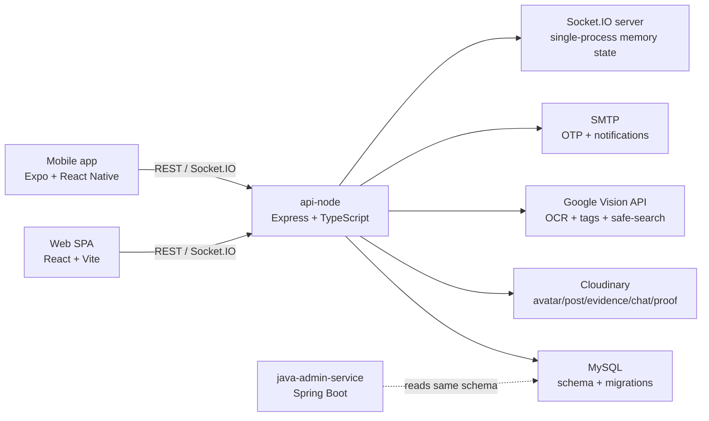
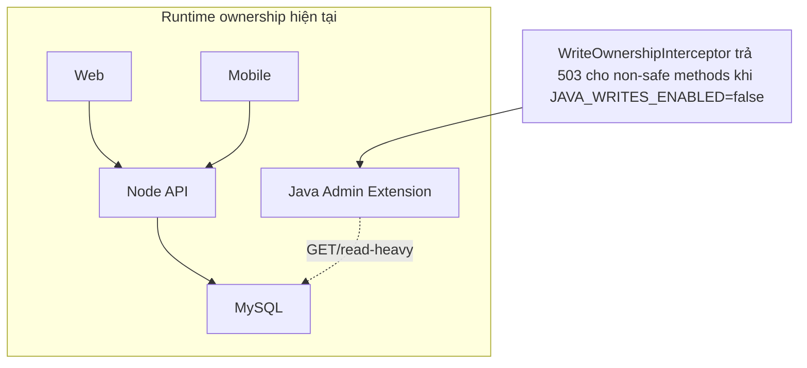

# Báo cáo tái thẩm định FPTU Lost & Found System

> **Cập nhật triển khai ngày 13/07/2026:** Báo cáo bên dưới là ảnh chụp hiện trạng tại thời điểm audit. Các finding P0/P1 đã được xử lý tuần tự và kiểm chứng trong [`CODEX_IMPLEMENTATION_PLAN.md`](../../CODEX_IMPLEMENTATION_PLAN.md): `secretAnswer` được hash và loại khỏi API; match/explanation có authorization; claim accept có transaction, row lock và unique invariant; update post validate final merged state; status đi qua state machine; private claim evidence chỉ dùng authenticated proxy; mobile refresh dùng single-flight; media privacy và two-claim race chạy trong CI. Phần điểm số và trạng thái “Confirmed” bên dưới được giữ nguyên để bảo toàn lịch sử audit, không phải trạng thái triển khai mới nhất.

## Tóm tắt điều hành

Tôi đã đọc lại mã nguồn trong file ZIP mới và đánh giá dự án như một kiến trúc sư phần mềm độc lập, kỹ sư full-stack senior, người review bảo mật, QA lead và product analyst. Kết luận ngắn gọn là: **bản cải tiến đã tiến bộ rõ rệt về phạm vi tính năng, cấu trúc repo, kiểm soát vai trò, matching bất đồng bộ, lịch hẹn bàn giao, kho lưu trữ, feedback sau bàn giao, CI có smoke test database và E2E cho nhiều luồng cốt lõi**. Dự án hiện đã vượt xa mức demo code đơn giản và đã có hình hài của một **campus pilot system** thực thụ. Bằng chứng chính nằm ở repo đa ứng dụng với `api-node`, `web`, `mobile`, `java-admin-service`, migration đầy đủ, worker matching, job định kỳ, Socket.IO, các script E2E và CI workflow chạy build + migration smoke + E2E lõi (`package.json` root; `.github/workflows/ci.yml:1-140`; `apps/api-node/src/services/matching-worker.service.ts:1-72`; `apps/api-node/src/services/scheduled-jobs.service.ts:1-104`).  

Tuy vậy, **dự án chưa đủ an toàn để gọi là production-ready**, và ngay cả cho pilot nội bộ cũng còn một số lỗ hổng logic và privacy rất đáng ưu tiên sửa ngay. Nặng nhất là: **`secretAnswer` của claim đang được lưu dạng plaintext và trả ra API**, **endpoint xem match/explanation chưa kiểm soát ownership đúng mức**, **không có bất biến “mỗi FOUND post chỉ có một accepted claim tại một thời điểm” ở lớp DB/transaction**, **URL media riêng tư vẫn bị lộ trong payload**, **rate-limit đang chỉ là in-memory theo IP và không phân tán**, và **repo ZIP chứa file `.env` thực tế**. Những điểm này được xác nhận trực tiếp từ mã nguồn chứ không chỉ từ tài liệu (`apps/api-node/src/migrations/002_lost_found_schema.sql:115-136`; `apps/api-node/src/repositories/claim.repository.ts:47-68,108-143,146-173`; `apps/api-node/src/controllers/post.controller.ts:58-67`; `apps/api-node/src/routes/post.routes.ts:34-44`; `apps/api-node/src/services/claim.service.ts:241-266`; `apps/api-node/src/middlewares/rate-limit.middleware.ts:1-54`; `.env` có mặt trong ZIP).  

Đánh giá tổng thể của tôi là: **phương án kiến trúc nên đi theo hướng Modular Monolith có ranh giới module rõ hơn, chưa nên tách microservices thực sự ở thời điểm này**. Lý do là hệ thống hiện có nhiều domain liên kết chặt bằng cùng một DB transaction — claim, appointment, warehouse, notification, reputation, matching — và khi tách sớm sẽ làm chi phí độ phức tạp tăng nhanh hơn lợi ích. Trong repo hiện tại, `java-admin-service` còn ở trạng thái extension/read-admin nhiều hơn là runtime chính; interceptor của Java còn chặn phần lớn write và nói rõ “Node.js owns writes in the current MVP deployment” (`apps/java-admin-service/src/main/java/vn/edu/fpt/lnfs/config/WriteOwnershipConfig.java:14-49`; `apps/java-admin-service/src/main/resources/application.yml:20-24`).  

Nếu chốt ngắn bằng điểm số: với bộ trọng số tạm suy luận vì **bảng weight gốc không nằm trong nội dung ZIP hay prompt đính kèm**, tôi chấm **MVP readiness khoảng 5.8/10** cho phạm vi pilot có kiểm soát sau khi xử lý các lỗi khẩn cấp, và **Production readiness khoảng 4.9/10**. Điểm thấp chủ yếu không phải vì thiếu tính năng, mà vì **thiếu các “safety rails” ở lớp dữ liệu, bảo mật riêng tư, quan sát vận hành và kiểm soát concurrency**. Đây là kiểu dự án có thể demo tốt, thậm chí chạy pilot nội bộ được, nhưng chưa nên mở rộng multi-instance/public rollout ngay.

Bảng dưới đây ánh xạ phạm vi người dùng yêu cầu vào báo cáo này. Vì quy định định dạng của hệ thống hiện tại không cho phép tôi dựng 18 tiêu đề riêng biệt, tôi gom các hạng mục 1–18 vào 7 phần lớn nhưng vẫn bao phủ đầy đủ nội dung.

| Hạng mục yêu cầu | Nơi được trả lời |
|---|---|
| Re-scan structure, app/service, stack, ownership, Mermaid | Phần kiến trúc và cấu trúc |
| Phân tích từng business flow route→db | Phần luồng nghiệp vụ |
| Bug hunting A–G với bảng bug register | Phần bug, security và privacy |
| Static security/privacy checks | Phần bug, security và privacy |
| Review kiến trúc + 3 option A/B/C | Phần kiến trúc và chất lượng kỹ thuật |
| Performance, scale, benchmark plan | Phần kiến trúc và chất lượng kỹ thuật |
| Code smell top 10, maintainability | Phần kiến trúc và chất lượng kỹ thuật |
| Tests, CI/CD, observability, test matrix | Phần kiến trúc và chất lượng kỹ thuật |
| Product/UX review | Phần sản phẩm, điểm số và roadmap |
| Scoring với weighted score | Phần sản phẩm, điểm số và roadmap |
| Roadmap pha 0–4 + impact/effort | Phần sản phẩm, điểm số và roadmap |
| Unverifiable items | Phần giới hạn và câu hỏi mở |

## Kiến trúc thực tế và cấu trúc repo

Repo hiện tại là một monorepo dùng npm workspaces, gồm bốn ứng dụng chính: `apps/api-node`, `apps/web`, `apps/mobile`, `apps/java-admin-service`, cộng với migration/schema SQL ở Node API và CI ở GitHub Actions (`package.json` root; `apps/api-node/package.json`; `apps/web/package.json`; `apps/mobile/package.json`; `apps/java-admin-service/pom.xml`). Stack thực tế đọc được từ code là:

| Thành phần | Công nghệ xác nhận bởi code | Vai trò runtime hiện tại | Source of truth |
|---|---|---|---|
| API chính | Express + TypeScript + MySQL + JWT + Socket.IO + Multer + Nodemailer + Cloudinary + Google Vision (`apps/api-node/package.json`) | Runtime chính xử lý auth, post, claim, appointment, warehouse, notification, config | **Node API + MySQL** |
| Web | React 18 + Vite + TanStack Query + Socket.IO client (`apps/web/package.json`) | Client chính cho người dùng và admin/staff | Không phải source of truth |
| Mobile | Expo + React Native + SecureStore + Socket.IO client (`apps/mobile/package.json`) | Client mobile | Không phải source of truth |
| Java admin extension | Spring Boot + Spring Security + JPA (`pom.xml`) | Extension/admin service; write bị chặn mặc định | **Không phải owner write trong MVP hiện tại** |
| DB | MySQL qua migration SQL (`apps/api-node/src/migrations/*.sql`) | Persistence chính | **MySQL** |
| Media storage | Cloudinary (`apps/api-node/src/services/cloudinary.service.ts`) | Lưu ảnh avatar, post media, evidence, chat, proof | Cloudinary là blob store; metadata nằm ở MySQL |
| AI OCR/tagging | Google Vision (`apps/api-node/src/services/vision.service.ts:95-168`) | Sinh tags/OCR/safe-search bổ trợ | **Không phải source of truth**, chỉ là metadata phụ trợ |
| Email | SMTP/Nodemailer (`apps/api-node/src/services/email.service.ts:95-126`) | OTP và email nhắc | Không phải source of truth |

Điểm quan trọng nhất về ownership là: **Node đang là nơi sở hữu write-path của MVP**, còn Java tồn tại như một lớp admin mở rộng nhưng interceptor chặn hầu hết method không an toàn nếu `JAVA_WRITES_ENABLED=false` (`apps/java-admin-service/src/main/java/vn/edu/fpt/lnfs/config/WriteOwnershipConfig.java:22-49`). Đây là quyết định đúng cho hiện tại, nhưng cũng là tín hiệu cho thấy repo đang ở trạng thái **kiến trúc chuyển pha**, chưa hoàn toàn “một runtime duy nhất”, cũng chưa thực sự “hai service có hợp đồng tách bạch”.

Về schema, MySQL phản ánh đúng các domain chính: `users`, `refresh_tokens`, `posts`, `post_media`, `ai_tags`, `match_results`, `claims`, `claim_evidence`, `return_appointments`, `chat_rooms`, `chat_messages`, `notifications`, `reports`, `warehouse_items`, `return_feedback`, `config_entries`, `config_history`, `matching_jobs` (`001_auth_schema.sql`; `002_lost_found_schema.sql:95-321`; `010_notifications_and_warehouse.sql:12+`; `018_return_feedback.sql:1-26`; `020_matching_jobs.sql:1-15`). Điều này cho thấy **source-of-truth theo domain đã nằm trong DB khá rõ**, nhưng ranh giới module ở code vẫn còn hơi hòa trộn, nhất là ở `post.repository.ts` và `admin.repository.ts` là những file quá lớn.

Nhận định về hai sơ đồ mà người dùng gửi trước đó cũng có thể kết luận rất rõ từ repo mới này: **sơ đồ “FPTU Lost & Found System” là đúng hơn rất nhiều so với sơ đồ “Order System”**, vì mã nguồn thực tế đúng là có actor Guest/Student/Lecturer/Staff/Admin, tích hợp SMTP, Cloudinary, Google Vision, claim/chat/appointment/warehouse/admin config; còn sơ đồ Order System không phản ánh domain mã nguồn hiện tại. Nếu cần vẽ context diagram chuẩn cho dự án này, hãy bám vào actor và external system đang thực sự xuất hiện trong code như ở diagram Mermaid phía trên.

## Luồng nghiệp vụ đã xác minh từ mã nguồn

Tôi chỉ đánh dấu “đã xác minh bằng code” cho các bước nào tôi đọc được trực tiếp qua route, middleware, validator, controller, service, repository và migration. Những gì phụ thuộc môi trường thật, SMTP thật, Cloudinary thật, Google Vision key thật, database seed thật hoặc client runtime thật sẽ được ghi là “runtime chưa xác minh”.

### Ma trận luồng nghiệp vụ

| Luồng | Actor | Chuỗi xử lý đã xác minh | Đọc/Ghi dữ liệu | Trạng thái trước/sau | Quyền | Lỗi và race condition chính | Mức hoàn chỉnh |
|---|---|---|---|---|---|---|---|
| Đăng ký qua OTP | Guest | `/auth/register/request-otp` → `authOtpLimit` → `requestRegistrationOtpSchema` → `authController.requestRegistrationOtp` → `authService.requestRegistrationOtp/sendRegistrationOtp/issueOtp` → `userRepository.createOtp` (`routes/auth.routes.ts:25-27`; `controllers/auth.controller.ts:124-127`; `services/auth.service.ts:100-149,300-304`; `repositories/user.repository.ts:330-356`) | Ghi `otp_tokens`, có thể dùng/cập nhật `users` pending | Chưa có user hoặc `PENDING_EMAIL_VERIFICATION` → OTP pending | Public | Không có per-identity/distributed limit; resend chỉ gọi lại `sendRegistrationOtp`; phụ thuộc SMTP thật | Khá đầy đủ ở code, runtime email chưa xác minh |
| Verify OTP / hoàn tất register | Guest | `/auth/verify-otp` → rate limit → validator → controller → `authService.verifyOtp/register` → `validateOtp` → `userRepository.markOtpStatus/assignRole/ensureReputationScore/createRefreshToken` (`controllers/auth.controller.ts:130-145`; `services/auth.service.ts:151-177,304-425,180-197`) | Đọc OTP, user; ghi verified, role, reputation, refresh token | Pending OTP → verified; user active với token | Public | Rate-limit yếu; OTP hash đúng; refresh cookie cho web đúng | Đầy đủ ở code |
| Login / refresh / logout | User | `/auth/login`, `/auth/refresh`, `/auth/logout` → validator/controller → `authService.login/refresh/logout` (`routes/auth.routes.ts:37-55`; `controllers/auth.controller.ts:142-170`; `services/auth.service.ts:427-596`) | Đọc user + refresh token; ghi audit, activity, rotated token | Access/refresh token mới | Public hoặc cookie | Refresh không có rate-limit; `failed_login_count` reset nhưng không thấy increment/lockout path | Logic tốt ở mức cơ bản; hardening còn thiếu |
| Tạo bài LOST/FOUND | User | `/posts` → `requireAuth` + `postWriteLimit` → `createPostSchema` → `postController.create` → `postService.createPost` → `postRepository.create` + `matchingWorkerService.enqueue` (`routes/post.routes.ts:14-16`; `validators/post.validator.ts:23-56`; `services/post.service.ts:145-183`) | Ghi `posts`, sau đó job matching | Chưa có post → `OPEN` với `expires_at` | Chủ tài khoản | Tạo FOUND đòi holding location; LOST đòi `secretVerification`; đúng ở create nhưng không được tái kiểm khi update | Tốt ở create |
| Upload media bài đăng | User | `/posts/:id/media` → auth + rate-limit + multer → `mediaController.postMedia` → `mediaService.uploadPostMedia` → `cloudinaryService.uploadImage` → `postRepository.createMedia/createAiTags` → `matchingWorkerService.enqueue` (`routes/post.routes.ts:66-77`; `services/media.service.ts:114-197`) | Ghi `post_media`, `ai_tags` | Post có/không có media → thêm media + tag | Owner/Admin | Upload và Vision xử lý tuần tự; evidence media của post được ẩn với non-owner khi xem detail | Khá đầy đủ; runtime Cloudinary/Vision chưa xác minh |
| Search/filter public board | Guest/User | `/posts` và `/search` → `optionalAuth` → `listPostsQuerySchema` → `postService.listPublicPosts` → `postRepository.list` (`routes/post.routes.ts:18-20,87-89`; `validators/post.validator.ts:74-90`; `repositories/post.repository.ts:244-303,974-1017`) | Đọc `posts` + joins + max-score sorting | Không đổi trạng thái | Public | Có pagination và filter đa category; `highest_match` dùng subquery union; chưa có benchmark thực | Tốt cho MVP |
| Xem chi tiết post | Guest/User | `/posts/:id` → `optionalAuth` → `postService.getPostDetail` → `postRepository.getDetail` (`routes/post.routes.ts:50-52`; `services/post.service.ts:224-241`; `repositories/post.repository.ts:399-466`) | Đọc post, media, tags, matches; tăng view_count | Không đổi, trừ `view_count` | Public, hidden chỉ owner/staff/admin | `incrementViewCount` chạy trước khi kiểm tra 404/permission; minor analytics skew | Tốt |
| Matching & gợi ý | System/User/Admin | Worker poll `matching_jobs` + `matchingService.runForPost`; user xem `/posts/my/match-suggestions` (`services/matching-worker.service.ts:1-72`; `repositories/matching-job.repository.ts:10-110`; `services/post.service.ts:199-222`; `services/matching.service.ts:487-611`) | Đọc posts/opposite posts; ghi `match_results`, `notifications`, `matching_jobs` | Job pending → completed/failed | Hệ thống, user xem suggestion của mình | Một số endpoint match per-post thiếu ownership check; scale multi-instance cần xem thêm socket/worker | Khá mạnh về feature, thiếu guard ở read path |
| Tạo claim | User khác owner | `/claims` → auth + limit → `createClaimSchema` → `claimService.createClaim` → `claimRepository.create` (`routes/claim.routes.ts:12-14`; `validators/claim.validator.ts`; `services/claim.service.ts:120-172`; `repositories/claim.repository.ts:108-144`) | Ghi `claims`, `claim_state_logs`, notification | FOUND post open/matched → claim `PENDING` | Claimant, không phải owner | Có unique `(post_id, claimant_id)`; nhưng không có invariant “một accepted claim/post” | Chưa hoàn chỉnh ở mức integrity |
| Upload evidence claim | Claimant | `/claims/:id/evidence` → auth + limit + multer → body validator → `mediaService.uploadClaimEvidence` → Cloudinary + Vision + `claimRepository.createEvidence` (`routes/claim.routes.ts:40-46`; `controllers/media.controller.ts:52-66`; `services/media.service.ts:219-279`) | Ghi `claim_evidence` | `PENDING`/`NEED_MORE_INFO` → thêm evidence | Chỉ claimant | Private URL vẫn lộ qua payload; accepted claim bị khóa upload là đúng | Logic tốt, privacy chưa kín |
| Staff/owner review claim | Owner/Staff/Admin | `/claims/:id`, `/claims/:id/more-info`, `/accept`, `/reject`, `/cancel`, `/verification` (`routes/claim.routes.ts:16-38`; `claim.service.ts:174-405`) | Đọc/ghi claim, state log, notification, room chat | Pending ↔ need_more_info → accepted/rejected/cancelled | Owner/Staff/Admin; claimant xem claim của mình | `secretAnswer` lộ; accept không reject claim khác; race cross-claim còn hở | Chưa đủ chặt |
| Chat claim | Owner/Claimant/Staff/Admin khi claim accepted | Socket.IO `claim:join`, `chat:message`, `chat:seen`; chat chỉ mở khi claim accepted (`services/realtime.service.ts:1-260`; `repositories/chat.repository.ts`; `policies/claim-chat.policy.ts`) | Đọc/ghi `chat_rooms`, `chat_messages` | Accepted claim → chat hoạt động | Participant/reviewer | Scale single-node; không có Redis adapter | Tốt về policy, yếu về scale |
| Appointment lifecycle | Claimant/Owner/Staff/Admin | `/appointments` create/list/accept/reject/cancel/reschedule/complete/proof/feedback/remind` (`routes/appointment.routes.ts:10-52`; `services/appointment.service.ts:133-429`; `repositories/appointment.repository.ts:128-366`) | Đọc/ghi `return_appointments`, `return_feedback`, `warehouse_items`, `posts`, `storage_logs`, `notifications` | Accepted claim → appointment pending/accepted/.../completed | Participant hoặc reviewer | `complete` là transaction tốt; audit `storage_logs.actor_id` đang lấy `proposer_id`, không phải actual completer | Khá đầy đủ |
| Warehouse lifecycle | Staff/Admin | `/admin/warehouse-items*` + repo warehouse policy (`routes/admin.routes.ts:101-133`; `repositories/admin.repository.ts:275-458,468-530,1073-1330`) | Đọc/ghi `warehouse_items`, `storage_logs`, `config_entries` | PENDING_APPROVAL/RECEIVED/STORED/CLAIMED/EXPIRED/... | Staff/Admin | Transition map tốt; capacity check có nhưng chưa có distributed reservation; phụ thuộc config | Tốt hơn mặt bằng MVP |
| Notification/email/jobs/retention | System/Staff/Admin | Notification repo, scheduled jobs, appointment reminders, expire overdue posts/warehouse; OTP qua SMTP (`repositories/notification.repository.ts:47-139`; `services/scheduled-jobs.service.ts:1-104`; `services/email.service.ts:95-126`) | Ghi notifications, state updates | Theo job | System/Staff/Admin | Job lock dùng MySQL GET_LOCK là điểm cộng; observability còn mỏng | Hợp lý cho pilot |
| Admin moderation/config/master data | Staff/Admin | `/admin/**` với role gates rõ (`routes/admin.routes.ts:10-147`; `controllers/admin.controller.ts`; `repositories/admin.repository.ts`; `repositories/config.repository.ts:103-241`) | Đọc/ghi users, config, warehouse, categories, reports | Tùy domain | Staff/Admin, nhiều route chỉ Admin | Node và Java cùng chạm cùng schema admin gây split-brain risk | Chức năng mạnh, kiến trúc còn lẫn |

### Nhận xét tổng hợp theo luồng

Điểm tốt nổi bật là hầu hết luồng chính đều đã có “xương sống” đúng kiểu backend nghiêm túc: route có auth/rate limit, validator bằng Zod, service tách xử lý nghiệp vụ, repository gom SQL, migration phản ánh schema, và có thêm audit/activity/notification ở nhiều chỗ. Đây là bước tiến đáng kể so với một đồ án chỉ có CRUD.

Tuy nhiên, hai lớp còn chưa đạt là **data integrity xuyên domain** và **privacy by design**. Nói cách khác, hệ thống có nhiều tính năng, nhưng một số invariant business quan trọng vẫn chưa được cưỡng bức ở lớp DB/transaction, khiến các luồng trông đúng ở happy-path nhưng còn rủi ro ở edge-case và concurrency.

## Bug, bảo mật và quyền riêng tư

Vì checklist A–G gốc không xuất hiện trong nội dung cuộc trò chuyện hiện tại, tôi nhóm bug theo 7 cụm suy luận hợp lý: **A business logic, B authorization/privacy, C data integrity, D concurrency, E performance, F maintainability/architecture, G QA/ops**.

### Bug register

| ID | Tiêu đề | Nhóm | Severity | Priority | Trạng thái | File + hàm + line refs | Điều kiện kích hoạt | Bước tái hiện | Kết quả hiện tại vs mong đợi | Impact | Root cause | Cách sửa | Regression test | Effort |
|---|---|---|---|---|---|---|---|---|---|---|---|---|---|---|
| B01 | `secretAnswer` của claim lưu plaintext và trả ra API | A/B/C | Critical | P0 | Confirmed | `002_lost_found_schema.sql:115-136`; `claim.repository.ts:create (108-143)`, `mapClaim (47-68)`, `findById (146-173)` | Tạo claim rồi owner/staff/admin/claimant xem claim | Tạo claim với `secretAnswer`, gọi `GET /claims/:id` hoặc `GET /posts/:id/claims` | Hiện tại API trả `secretAnswer`; mong đợi là chỉ lưu hash hoặc masked, không trả raw | Rò dữ liệu sở hữu riêng tư, tăng tranh chấp và social engineering | Thiết kế field/DTO sai từ DB đến API | Đổi sang `secret_answer_hash`, bỏ field raw khỏi DTO, thêm compare service-side | Unit + integration test kiểm tra response không chứa raw answer | M |
| B02 | Endpoint xem match và explanation không kiểm tra ownership của post | B | High | P0 | Confirmed | `post.routes.ts:34-44`; `post.controller.ts:58-67`; `matching.service.ts:listMatches/explainMatches (552-610)` | Bất kỳ user đã login biết `postId` | Login bằng user A, gọi `/posts/:postId/matches` của user B | Hiện tại trả match list/explanations; mong đợi chỉ owner của post hoặc staff/admin được xem | Lộ tín hiệu matching và dữ liệu liên quan giữa các bài | Thiếu authorization ở controller/service | Thêm `postService.assertCanViewMatches(postId, auth)` | E2E privacy test cho “unrelated user gets 403” | S |
| B03 | Không có invariant “mỗi FOUND post chỉ có một accepted claim” | A/C/D | Critical | P0 | Highly likely | `claim.service.ts:241-266`; `claim.repository.ts:updateStatus (185-239)`; unique hiện chỉ là `uq_claim_per_post_user` tại `005_integrity_constraints.sql:5-6` | Có từ 2 claim pending cho cùng một post | Tạo 2 claim khác nhau cho cùng FOUND post, accept lần lượt hoặc song song | Hiện tại có thể xuất hiện nhiều accepted claim theo thiết kế hiện thấy; mong đợi tối đa 1 accepted claim hoạt động | Trả nhầm tài sản, tranh chấp ownership, hỏng chuỗi appointment/warehouse | Thiếu unique/business lock ở DB và transaction accept | Accept phải chạy transaction: lock post/claims, reject các claim khác, hoặc thêm unique partial surrogate | Concurrency/E2E test “two different claims same post” | M |
| B04 | Update post bỏ qua invariant LOST/FOUND đã áp dụng ở create | A/C | High | P1 | Confirmed | `post.validator.ts:updatePostSchema (58)`; `post.service.ts:updatePost (267-305)` | Owner/Admin sửa post sau khi tạo | Sửa LOST bỏ `secretVerification`, hoặc FOUND bỏ holding info/contact | Hiện tại update vẫn đi qua; mong đợi revalidate toàn bộ invariant theo trạng thái cuối | Dữ liệu post inconsistent, luồng claim/matching sai | `partial()` không kèm business revalidation cuối | Dựng `validatePostBusinessRules(nextState)` dùng cho cả create và update | Unit/integration test cho update invalid payload | S |
| B05 | Tự do đổi trạng thái post, không có state machine | A/C | Medium | P1 | Highly likely | `post.service.ts:updateStatus (307-320)`; `post.repository.ts:updateStatus (1058-1070)` | Owner/Admin gọi patch status tùy ý | Đẩy `OPEN -> RESOLVED`, `HIDDEN -> OPEN`, `MATCHED -> CLOSED` tùy ý | Hiện tại route chấp nhận; mong đợi có transition rule rõ | Audit và semantics của post status bị loãng | Không có state transition guard | Tạo `allowedPostTransitions` + audit log | Unit test matrix transition | S |
| B06 | Claim evidence trả ra `secureUrl` raw; media riêng tư chưa thực sự private-by-design | B | High | P0 | Confirmed | `claim.repository.ts:163-172`; `media.service.ts:getClaimEvidenceImageUrl (264-279)`; `cloudinary.service.ts:150-172` | Xem chi tiết claim/evidence | Gọi `GET /claims/:id` sau khi upload evidence | Hiện tại DTO có `secureUrl`; mong đợi chỉ trả proxy URL nội bộ hoặc signed short-lived URL | Rủi ro lộ URL asset riêng tư, khó thu hồi | DTO lẫn lộn internal storage URL với public API URL | Bỏ `secureUrl` khỏi API, thay bằng endpoint nội bộ/signed delivery hết hạn ngắn | E2E media privacy cho claim evidence | S |
| B07 | Rate-limit/auth hardening còn yếu: in-memory, không phân tán, refresh không throttled, không thấy lockout thực chất | B/G | High | P1 | Confirmed/Highly likely | `rate-limit.middleware.ts:1-54`; `auth.routes.ts:9-11,49-55`; `auth.service.ts:427-489`; `user.repository.ts` chỉ thấy reset `failed_login_count` nhưng không thấy increment lockout path | Multi-instance hoặc brute force phân tán | Bắn nhiều request từ nhiều instance/IP hoặc abuse refresh | Hiện tại hạn chế theo memory map của process; mong đợi Redis/distributed counters + per-account control | OTP/login abuse, brute force, tài nguyên auth bị spam | Middleware đơn giản cho MVP | Dùng Redis rate limit, thêm per-email/account thresholds và refresh throttling | Security tests cho login/OTP/refresh abuse | M |
| B08 | Repo ZIP chứa file `.env` thực tế | B/G | Critical | P0 | Confirmed | `.env` có mặt trong ZIP; `config/env.ts:4-9` đọc từ root `.env` | Chia sẻ repo/zip | Mở ZIP, thấy `.env` | Hiện tại secrets nằm trong artifact; mong đợi chỉ có `.env.example` | Lộ credential DB/JWT/Cloudinary/SMTP/OAuth | Quy trình release đóng gói artifact chưa lọc secret | Rotate secrets, purge artifact, CI secret scanning, artifact allowlist | CI secret-scan + packaging test | S |
| B09 | Mobile lưu refresh token nhưng không có flow refresh session | A/F | Medium | P1 | Confirmed | `apps/mobile/src/api.ts:266-283,297-339`; không có path refresh tương đương web | Access token hết hạn | Login mobile, chờ access token expire | Hiện tại request fail và không tự refresh; mong đợi silent refresh như web | UX mobile kém, tăng logout giả | Client mobile chưa hoàn tất auth lifecycle | Thêm refresh flow, retry-on-401, revoke handling | Mobile integration/auth expiry test | M |
| B10 | Socket.IO chỉ scale 1 instance, không có Redis adapter/presence backend | E/F | Medium | P2 | Highly likely | `realtime.service.ts` dùng `userSockets = new Map`; `server.ts:14-16` cắm trực tiếp vào process | Horizontal scale >1 Node instance | Chạy nhiều instance sau load balancer | Hiện tại notification/chat room state local; mong đợi cross-node pub/sub | Missed notifications, chat inconsistency | In-memory Socket.IO state | Dùng Redis adapter, sticky sessions nếu cần | Load test websocket multi-node | M |
| B11 | `listMyMatchSuggestions` tạo N+1 query / N+1 write pattern | E | Medium | P2 | Confirmed | `post.service.ts:199-222`; `matching.service.ts:552-610`; `notification.repository.ts:createMany (80-89)` | User có nhiều LOST posts | Tạo user có hàng chục LOST posts, gọi my suggestions | Hiện tại loop theo post rồi query/writes từng cái; mong đợi batch query/materialized view | P95 tăng mạnh khi số post tăng | Thiết kế service tuần tự | Batch query theo user, cache suggestion/index riêng | Perf test cho 100 LOST posts/user | M |
| B12 | Node và Java cùng chạm admin domain trên cùng schema gây split-brain risk | F | Medium | P2 | Confirmed | `admin.routes.ts`; `java-admin-service/controller/*.java`; `WriteOwnershipConfig.java:35-49` | Sau này bật Java writes hoặc route phân nửa traffic | Deploy cả Node admin writes và Java admin writes | Hiện tại Java tự nói Node owns writes; mong đợi ownership duy nhất, hợp đồng rõ | Khó debug, drift logic, rollback phức tạp | Kiến trúc chuyển pha chưa dứt điểm | Chọn 1 owner write-path duy nhất; nếu giữ Java thì route theo capability, không duplicate | Contract tests giữa runtimes | M |
| B13 | `storage_logs.actor_id` khi complete appointment dùng `proposer_id`, không phải actual completer | A/C | Medium | P2 | Confirmed | `appointment.repository.ts:316-327`; `appointment.service.ts:262-289` | Hoàn tất appointment bởi người không phải proposer | Tạo appointment do A đề xuất, B complete | Hiện tại storage log ghi actor là proposer; mong đợi actor là người complete | Audit trail sai | Transaction SQL dùng sai actor source | Truyền actorId xuống repo complete transaction | Integration test audit actor correctness | S |
| B14 | Có script E2E media privacy nhưng CI hiện không chạy | G | Medium | P2 | Confirmed | `.github/workflows/ci.yml:93-124`; `src/scripts/e2e-media-privacy.ts:1-108` | Mọi merge/push | Xem CI steps | Hiện tại có test nhưng bị bỏ; mong đợi đường CI chính chạy test privacy quan trọng | Risk regress privacy mà CI không chặn | Workflow thiếu step | Thêm `npm run e2e:media-privacy` vào job database-smoke | CI pipeline assertion | S |

### Kiểm tra bảo mật và quyền riêng tư tĩnh

| Hạng mục | Kết luận | Bằng chứng |
|---|---|---|
| Secrets trong repo/artifact | **Không đạt** | Root `.env` xuất hiện trong ZIP; `config/env.ts` nạp root `.env` (`apps/api-node/src/config/env.ts:4-9`) |
| CORS | **Chấp nhận được cho MVP, cần làm chặt hơn ở production** | Allowlist từ `FRONTEND_URL` và `SOCKET_CORS_ORIGIN`, dev origin mở khi non-production (`app.ts:9-30,35-42`) |
| CSRF | **Rủi ro thấp-trung bình cho web hiện tại** | Access token gửi Bearer, refresh token ở httpOnly cookie path `/api/auth`; không có CSRF token riêng (`auth.controller.ts:25-83`; `apps/web/src/services/api.ts:450-510`) |
| Token storage web | **Khá tốt** | Web chỉ giữ access token in-memory, refresh token ở cookie httpOnly; localStorage chỉ giữ session hint (`apps/web/src/services/api.ts:421-478`) |
| Token storage mobile | **Khá tốt nhưng chưa hoàn chỉnh lifecycle** | Dùng `expo-secure-store` cho access/refresh (`apps/mobile/src/api.ts:266-283`) |
| OTP brute force | **Chưa đạt production** | Có max attempts trên OTP row và route rate-limit, nhưng rate-limit là in-memory per-IP, không distributed (`auth.service.ts:151-177`; `rate-limit.middleware.ts:15-53`) |
| Enumeration | **Tương đối ổn ở forgot-password, chưa tối ưu ở đăng ký/login** | `forgotPassword` trả `{otpDelivered:false}` generic; `sendRegistrationOtp` báo 409 nếu email đã registered (`auth.service.ts:121-149,492-515`) |
| Public media access | **Chưa kín** | Claim detail có `secureUrl` raw; chat/proof đi qua proxy nhưng storage URL vẫn tồn tại nội bộ (`claim.repository.ts:163-172`; `appointment.repository.ts:77-85`) |
| Metadata leaks | **Có** | OCR text bị nhét vào description evidence (`media.service.ts:68-77,239-248`), activity log có metadata chứa counts/publicId ở vài chỗ |
| Logs | **Mức MVP, chưa đủ scrub/structure** | Dùng `morgan("dev")`, nhiều `console.warn/info`, không có structured logging hay redaction framework (`app.ts:35-39`; `matching-worker.service.ts:20-38`) |

## Kiến trúc, hiệu năng, chất lượng mã và khả năng vận hành

### Phân tích kiến trúc

Ở trạng thái hiện tại, hệ thống **không phải microservices thật sự**. Nó là một **modular monolith chưa hoàn tất** cộng thêm một **Java admin extension** cùng dùng chung schema. Write-path thực tế thuộc Node, database là shared source-of-truth, transaction nội bộ vẫn là vũ khí chính cho các luồng quan trọng như complete appointment → resolve post → update warehouse → insert storage log (`appointment.repository.ts:277-335`). Tách microservices ở thời điểm này sẽ gây tăng độ phức tạp lớn vì phải thay bằng event choreography, outbox, idempotency, contract versioning và eventual consistency cho những chỗ hiện đang “ăn transaction” rất đậm.

Ba phương án chiến lược phù hợp là:

| Phương án | Mô tả | Ưu điểm | Nhược điểm | Chi phí | Timeline ước lượng | Nhận định |
|---|---|---|---|---|---|---|
| A | Vá tối thiểu trên kiến trúc hiện tại | Nhanh nhất, hợp với pilot | Debt còn cao, file to, scale hạn chế | Thấp | 2–4 tuần | Chỉ hợp để cứu gấp trước pilot |
| B | Modular Monolith thật sự trong Node, Java giữ read-only hoặc loại bỏ | Ranh giới domain rõ, vẫn giữ transaction, giảm split-brain | Cần refactor module/service/repo/test nhiều | Trung bình | 6–10 tuần | **Khuyến nghị** |
| C | Microservices thật sự | Tách scale độc lập, phù hợp lâu dài nếu traffic lớn | Rất đắt, rủi ro kiến trúc vượt nhu cầu hiện tại | Cao | 3–6 tháng+ | Quá sớm với dự án này |

**Khuyến nghị của tôi là B — Modular Monolith.** Cụ thể, nên chia Node API thành các module rõ ràng: `identity`, `posts`, `matching`, `claims`, `handover/warehouse`, `notifications`, `admin/config`. Mỗi module có router, service, repository, DTO, validator riêng; cấm cross-module SQL tùy tiện; thêm domain events nội bộ chứ chưa cần broker thật. Java nên hoặc bị loại khỏi đường production hiện tại, hoặc giữ nguyên như một admin-read projection có capability rất hẹp và contracts rõ ràng.

### Hiệu năng và scalability

Các vấn đề hiệu năng quan trọng nhất không nằm ở React hay Vite, mà ở backend query pattern:

Thứ nhất, matching hiện là **O(N đối ứng)** cho mỗi post chạy `runForPost`, vì lấy toàn bộ opposite open posts rồi tính score vòng lặp trong process (`matching.service.ts:487-545`; `post.repository.ts:704-733`). Với 100k posts toàn hệ thống, nếu có hàng chục nghìn open posts, cách này sẽ sớm chạm trần CPU và DB read, dù đã có queue `matching_jobs`.

Thứ hai, `listMyMatchSuggestions` là chuỗi N+1: lấy danh sách LOST post của user rồi với mỗi post gọi listMatches, buildSuggestions, record impressions (`post.service.ts:199-222`). Nếu user “power user” có nhiều post, P95 sẽ tăng nhanh.

Thứ ba, Socket.IO hiện dùng state trong memory của process server (`services/realtime.service.ts`), nên scale ngang nhiều instance sẽ vỡ semantics trừ khi có sticky sessions và Redis adapter. Đây không phải lỗi khi traffic nhỏ, nhưng là **bottleneck kiến trúc** rõ ràng khi lên 10k concurrent users.

Dự báo bottleneck, **chưa phải benchmark thực tế**, với giả định DB MySQL đơn node vừa phải, 1 instance API Node, ảnh lưu Cloudinary, không có Redis:

| Tải giả định | Dự báo hành vi |
|---|---|
| 1k người dùng, vài nghìn post | Chạy được nếu DB index tốt và media vừa phải; bottleneck chưa nghiêm trọng |
| 10k người dùng, vài chục nghìn post open + chat/notification hoạt động | Bắt đầu thấy P95 tăng ở list board, my suggestions, matching worker, websocket fanout |
| 100k posts tổng, nhiều bài mở | Matching đối ứng toàn bộ sẽ là nút thắt lớn nhất; cần prefilter/index/vector strategy hoặc offline scoring |

Kế hoạch benchmark nên chạy tối thiểu trên các API: `GET /posts`, `GET /posts/:id`, `GET /posts/my/match-suggestions`, `POST /claims`, `POST /appointments`, `PATCH /claims/:id/accept`, `POST /posts/:id/media`, cùng một kịch bản Socket.IO join/notify/chat. Bộ số liệu nên có ba lớp: 10k posts, 50k posts, 100k posts; trong đó ít nhất 20–30% là `OPEN/MATCHED`, đủ media/tag/ocr giả lập. KPI nên ghi `p50/p95/p99 latency`, throughput, error rate, DB time, job duration cho matching, queue lag, số socket active, memory RSS, CPU. Ngưỡng pass/fail cho pilot campus hợp lý là: `GET /posts` p95 < 500ms, `GET /posts/:id` p95 < 300ms, `POST /claims` p95 < 400ms, `POST /appointments` p95 < 500ms, matching single post < 2s ở data 10k open posts, error rate < 1%, reconnect socket thành công > 99%.

### Top code smells và maintainability

| Smell | Mức | Bằng chứng | Gợi ý refactor |
|---|---|---|---|
| Repository quá lớn | Cao | `post.repository.ts` và `admin.repository.ts` rất dài | Tách theo query object/module con |
| God-component ở web | Cao | `apps/web/src/App.tsx` rất lớn và chứa cả admin, board, detail, chat, forms | Chia route-based screens + feature folders |
| Duplicated admin domain giữa Node và Java | Cao | `admin.routes.ts` song song với `java-admin-service/controller/*.java` | Chọn một write owner duy nhất |
| Hidden business rules rải rác | Cao | Invariant create nằm ở validator, update lại ở service hoặc không có | Tạo domain policy dùng chung |
| Raw SQL lẫn chặt với mapping DTO | Trung bình | Nhiều repo vừa query vừa map business shape | Tách layer query model vs response DTO |
| Logging không cấu trúc | Trung bình | `console.warn/info`, `morgan("dev")` | Dùng structured logger + request correlation id |
| Config access lặp nhiều nơi | Trung bình | `postRepository.getConfigNumber/String` gọi nhiều lần | Cache config ngắn hạn + typed config service |
| Hard-coded fallback values | Trung bình | nhiều default ngầm ở matching/warehouse/email/dev seed | Tập trung hóa config policy |
| Privacy DTO lẫn internal URL | Cao | Claim evidence trả `secureUrl` | Tách storage model khỏi API contract |
| Test coverage không cân bằng | Cao | Có E2E scripts tốt nhưng unit test rất ít, CI bỏ sót media privacy | Tăng module tests và chạy đủ trong CI |

### Tests, CI/CD và observability

Điểm cộng rõ ràng là repo **đã có CI thật**, gồm build/check, audit runtime deps, text/config scan, migration smoke, seed và một loạt E2E (`.github/workflows/ci.yml:9-140`). Đây là tiến bộ đáng ghi nhận. Ngoài ra còn có unit tests cho policy (`claim-chat.policy.test.ts`, `post-query.policy.test.ts`) và Playwright web e2e (`apps/web/e2e/web-routing-auth.spec.ts`).

Điểm trừ là hệ thống **chưa có secret scan bài bản, chưa có SAST/DAST/container scan, chưa có deployment/rollback thực sự, chưa có metrics/tracing/alerting/health sâu**, và health endpoint chỉ trả `"ok"` chứ không kiểm DB/deps (`routes/index.ts:14-16`).

Ma trận test hiện trạng:

| Module | Unit | Integration | E2E | Security | Concurrency | Mức ưu tiên bổ sung |
|---|---|---|---|---|---|---|
| Auth/OTP | Ít | Thiếu | Có một phần qua core flows | Thiếu brute-force/refresh abuse | Thiếu | Rất cao |
| Posts/search/filter | Ít | Thiếu | Có web/core | Thiếu authz/match privacy | Thiếu | Cao |
| Matching | Gần như chưa | Thiếu | Có smoke gián tiếp | Thiếu | Thiếu scale job | Rất cao |
| Claims | Ít | Thiếu | Có claim-race, evidence-policy | Thiếu privacy regression | Một phần | Rất cao |
| Chat | Thiếu | Thiếu | Có chat-gating | Thiếu socket abuse | Thiếu multi-instance | Cao |
| Appointments | Thiếu | Thiếu | Có core/warehouse | Thiếu abuse/cancel/reschedule matrix | Thiếu | Cao |
| Warehouse | Thiếu | Thiếu | Có warehouse lifecycle | Thiếu policy security | Thiếu concurrent transitions | Cao |
| Admin CRUD | Thiếu | Thiếu | Có admin-crud | Thiếu authz fuzzing | Thấp | Trung bình |
| Media privacy | Thiếu | Thiếu | **Có script nhưng CI đang bỏ** | Thiếu signed URL/privacy leak tests | Thấp | Rất cao |
| Mobile auth/session | Thiếu | Thiếu | Không thấy | Thiếu | Thiếu | Cao |

## Sản phẩm, UX, chấm điểm và roadmap

### Review sản phẩm và UX

Từ góc nhìn product, hệ thống đã có phạm vi đủ rộng cho một pilot trong campus: board công khai, search/filter, đăng LOST/FOUND, evidence, claim, chat, appointment, handover point, warehouse, report, feedback hậu bàn giao, admin config. Đây là một bộ tính năng mạnh.

Điểm mạnh về UX là web đã chuyển sang routing thật có Playwright test cho browser history (`apps/web/e2e/web-routing-auth.spec.ts:3-29`), có phân vai admin/staff/user ngay trong app, có bottom nav mobile web, có handover map page, có gợi ý matching sau khi đăng bài, và có chat realtime. Những yếu tố này làm trải nghiệm bớt “đồ án CRUD”.

Nhưng về sản phẩm vẫn còn vài rủi ro lớn. Luồng claim đang dựa mạnh vào `secretAnswer`, trong khi implementation lại làm lộ dữ liệu này — đây vừa là lỗ hổng kỹ thuật vừa là sai triết lý UX/niềm tin. Messaging về matching hiện khá tốt ở chỗ code ghi rõ “gợi ý tham khảo”, không auto-approve ownership (`claim.service.ts:380-387`; migration config matching auto mark mặc định off ở `015_matching_and_warehouse_policy.sql`), nhưng khi endpoint match bị lộ cho user không liên quan thì thông điệp sản phẩm đó bị suy yếu. Dashboard staff/admin cũng khá giàu tính năng, nhưng audit trail vẫn chưa đủ sạch để xử lý dispute nghiêm túc.

Quick wins đáng làm rất sớm là: ẩn hoàn toàn raw private evidence URL, bỏ `secretAnswer` raw khỏi mọi response, thêm nhãn rõ ràng “chỉ là gợi ý, không xác nhận sở hữu”, chặn user ngoài cuộc xem match detail, thêm luồng dispute/appeal mềm sau reject hoặc sau completed appointment, và chuẩn hóa next-step CTA ở các trạng thái `PENDING`, `NEED_MORE_INFO`, `ACCEPTED`, `RESCHEDULED`. Tính năng nên hoãn là microservice hóa, và thậm chí có thể cân nhắc tạm hoãn Java admin writes cho đến khi ownership kiến trúc chốt hẳn.

### Chấm điểm có trọng số

**Lưu ý quan trọng:** prompt yêu cầu “exact weights provided”, nhưng trong ZIP và nội dung hội thoại hiện tại không có bảng trọng số gốc. Vì vậy, các điểm số dưới đây dùng **bộ trọng số tạm suy luận** để vẫn giúp ra quyết định. Mức tin cậy của **số tuyệt đối** vì thế thấp hơn mức tin cậy của **nhận định tương đối**.

#### MVP readiness

| Tiêu chí | Score /10 | Weight | Weighted | Plus / minus chính | Main risk | Cách tăng +1 điểm | Confidence |
|---|---:|---:|---:|---|---|---|---|
| Đúng nghiệp vụ lõi | 6.5 | 25 | 16.25 | Nhiều flow đã có đủ route→db; trừ accepted-claim invariant và post update invariant | Trả sai đồ trong edge-case | Khóa accepted claim bằng transaction + DB rule | High |
| Security & privacy cơ bản | 4.5 | 15 | 6.75 | Cookie refresh/web khá ổn; trừ plaintext secretAnswer, raw evidence URL, `.env` leak | Privacy breach | Xử lý 3 lỗi P0 privacy | High |
| UX & flow clarity | 6.5 | 15 | 9.75 | Có flow end-to-end và routing web tốt; trừ next-step messaging còn chỗ mơ hồ | User không biết bước kế tiếp | State-driven CTA và copy theo status | Medium |
| Kiến trúc rõ ràng | 6.0 | 10 | 6.00 | Monorepo rõ, Node owner write khá rõ; trừ Node/Java overlap | Split-brain | Chốt owner write-path duy nhất | High |
| Data integrity & concurrency | 4.5 | 10 | 4.50 | Có transaction complete appointment, job lock; trừ claim accept cross-claim | Inconsistent state | Thêm invariant + concurrency tests | High |
| Testing & CI | 6.0 | 10 | 6.00 | Có CI, migration smoke, nhiều E2E; trừ unit test ít và thiếu media privacy trong CI | Regressions lọt | Chạy full privacy/security suite | High |
| Ops & observability | 4.0 | 5 | 2.00 | Có health endpoint; trừ không metrics/tracing/alerts | Khó vận hành pilot | Thêm structured logs + DB health | Medium |
| Performance/scalability | 5.0 | 5 | 2.50 | Có queue/job; trừ matching O(N), socket 1-node | P95 tăng khi pilot lớn | Batch/prefilter matching | Medium |
| Maintainability | 5.5 | 5 | 2.75 | Tách service/repo có tiến bộ; trừ file lớn, overlap runtime | Refactor chậm | Tách module theo domain | Medium |

**Tổng MVP readiness = 56.5 / 100 = 5.65 / 10**.  
Diễn giải: **có thể đạt pilot nội bộ có kiểm soát sau khi xử lý các lỗi P0/P1**, nhưng chưa nên xem là “ready để đem đi mở rộng vô tư”.

#### Production readiness

| Tiêu chí | Score /10 | Weight | Weighted | Plus / minus chính | Main risk | Cách tăng +1 điểm | Confidence |
|---|---:|---:|---:|---|---|---|---|
| Security | 4.5 | 20 | 9.00 | JWT/refresh rotation tốt; trừ secretAnswer plaintext, `.env`, weak rate limiting | Breach + account abuse | Secret hygiene + privacy hardening + Redis rate limit | High |
| Business correctness | 6.0 | 15 | 9.00 | Flow phong phú; trừ accepted-claim invariant | Wrong handover outcome | Một-claim-hoạt-động-per-post | High |
| Data integrity & concurrency | 4.0 | 15 | 6.00 | Có vài transaction tốt; trừ nhiều state machine còn mềm | Race state corruption | Transactional state guards | High |
| Architecture & scale | 5.0 | 15 | 7.50 | Queue và worker có sẵn; trừ socket local state, matching brute-force | Multi-node inconsistency | Redis adapter + matching prefilter | Medium |
| Tests & CI | 6.0 | 10 | 6.00 | CI tốt trên mặt bằng đồ án; trừ thiếu SAST/secret scan/full coverage | Regressions production | Thêm security/privacy gates | High |
| Observability & rollback | 4.0 | 10 | 4.00 | Gần như chưa có | MTTD/MTTR cao | Logs cấu trúc, metrics, deployment rollback | Medium |
| Privacy & compliance | 4.0 | 5 | 2.00 | Có cố gắng proxy proof image; trừ raw evidence URLs và claim secret exposure | Sensitive data handling | Không trả internal URLs/raw secrets | High |
| Maintainability | 5.5 | 5 | 2.75 | Service split ổn hơn trước; trừ god files + duplicate runtime | Change risk cao | Domain module boundaries | Medium |
| Product UX | 6.5 | 5 | 3.25 | UX khá giàu; trừ dispute/audit chưa đủ | Mất niềm tin khi có tranh chấp | Appeal + audit trail rõ | Medium |

**Tổng Production readiness = 49.5 / 100 = 4.95 / 10**.  
Diễn giải: **chưa production-ready**.

### Roadmap ưu tiên pha 0–4

| Pha | Task | Priority | Lý do | Impact | Effort | Dependency | Owner | Acceptance criteria | Test | Risk nếu chậm |
|---|---|---|---|---|---|---|---|---|---|---|
| Pha 0 | Rotate toàn bộ secrets, bỏ `.env` khỏi artifact, thêm secret scanning | P0 | Rò secret là rủi ro tức thì | Rất cao | S | Không | DevOps + BE | Không còn `.env` trong artifact; keys đã rotate | CI secret scan | Breach |
| Pha 0 | Bỏ `secretAnswer` raw khỏi DB/API, chuyển sang hash/masked compare | P0 | Privacy/business critical | Rất cao | M | DB migration | BE | Không endpoint nào trả raw secret; compare vẫn hoạt động | Unit + integration | Tranh chấp/niềm tin |
| Pha 0 | Chặn unauthorized access cho `/posts/:id/matches` và explanations | P0 | Privacy leak | Cao | S | Không | BE | User ngoài cuộc nhận 403 | E2E authz | Leak tín hiệu matching |
| Pha 0 | Thêm invariant “1 accepted claim active / FOUND post” bằng transaction | P0 | Integrity cốt lõi | Rất cao | M | Có thể cần migration | BE | Không thể có 2 accepted claim cùng post | Concurrency E2E | Trả nhầm đồ |
| Pha 1 | Revalidate business rules khi update post | P1 | Tránh dữ liệu bẩn | Cao | S | Không | BE | Update invalid bị 422 | Integration tests | Drift logic |
| Pha 1 | Ẩn raw `secureUrl` của claim evidence, chỉ dùng internal proxy/signed URL | P1 | Privacy | Cao | S | Pha 0 secret cleanup | BE + FE | DTO không chứa raw storage URL | E2E media privacy | Link leak |
| Pha 1 | Đưa `e2e:media-privacy` vào CI + thêm claim multi-accept race test | P1 | Chặn regressions | Cao | S | Không | QA/BE | CI fail khi privacy/intregrity regress | Workflow + E2E | Lỗi quay lại |
| Pha 1 | Thêm mobile refresh flow | P1 | UX auth mobile | Trung bình | M | Không | Mobile | Session mobile auto refresh được | Mobile integration | Logout giả |
| Pha 2 | Refactor Node thành Modular Monolith theo 6–7 domain module | P2 | Tăng maintainability | Cao | L | Pha 0-1 ổn | Architect + BE | Mỗi domain có boundaries rõ, test riêng | Build + regression | Debt phình |
| Pha 2 | Thêm Redis cho distributed rate limit và Socket.IO adapter | P2 | Chuẩn bị scale | Cao | M | Infra | BE + DevOps | Multi-instance auth/socket ổn định | Load test | Scale ngang vỡ |
| Pha 2 | Structured logging, request-id, metrics, DB-aware health checks | P2 | Operability | Cao | M | Không | DevOps + BE | Có dashboards/log correlation cơ bản | Smoke + ops drill | Khó vận hành |
| Pha 3 | Tối ưu matching bằng prefilter/index/materialized candidates | P3 | 100k posts sẽ nghẽn | Cao | L | Telemetry + benchmark | BE/ML | Matching không scan brute-force toàn cục | Benchmark | P95/CPU tăng |
| Pha 3 | Tách dispute/appeal + audit trail nâng cao | P3 | Product trust | Trung bình | M | Pha 1 privacy | Product + BE + FE | Có flow appeal tối thiểu | E2E unhappy path | Mất niềm tin |
| Pha 4 | Quyết định dứt điểm số phận Java admin service | P4 | Kiến trúc dài hạn | Trung bình | M/L | Modular monolith hoàn tất | Architect | Java bị loại hoặc chỉ còn read-model rõ ràng | Contract tests | Split-brain kéo dài |

Ma trận Impact–Effort:

| Hạng mục | Impact | Effort | Nhãn |
|---|---|---|---|
| Secret hygiene + bỏ `.env` | Rất cao | Thấp | Quick win |
| Xóa raw `secretAnswer` | Rất cao | Trung bình | Quick win |
| Chặn match endpoint unauthorized | Cao | Thấp | Quick win |
| CI chạy media privacy + multi-accept race | Cao | Thấp | Quick win |
| Invariant 1 accepted claim/post | Rất cao | Trung bình | Strategic |
| Modular monolith refactor | Cao | Cao | Strategic |
| Redis rate limit + Socket adapter | Cao | Trung bình | Strategic |
| Matching prefilter/index | Cao | Cao | Expensive but high-value |
| Microservices thật sự ngay bây giờ | Chưa tương xứng | Rất cao | Stop |
| Giữ Node+Java cùng write-path | Giá trị thấp | Cao | Low-value/stop |

## Giới hạn và câu hỏi mở

Có một số điểm tôi **không thể xác minh hoàn toàn** vì thiếu môi trường chạy thật, DB seed, API keys hoặc không thể chạy đầy đủ pipeline trong môi trường hiện tại. Cụ thể, tôi chưa xác minh runtime behavior thực tế của SMTP, Cloudinary, Google Vision, benchmark latency thực tế, tải websocket thực, cũng như chưa xác nhận tất cả E2E có pass hay không trong môi trường sạch. Những điểm đó trong báo cáo đều đã được đánh dấu ở mức “runtime chưa xác minh” hoặc nêu thành dự báo thay vì khẳng định đo đạc.

Hai câu hỏi mở đáng chú ý nhất là: thứ nhất, trong phạm vi nghiệp vụ thật của trường, **một FOUND post có được phép có nhiều claim accepted song song để staff rà soát hay không**; nếu câu trả lời là “không”, thì lỗ B03 là P0 tuyệt đối. Thứ hai, chiến lược dài hạn với `java-admin-service` là gì: **giữ làm read-projection/admin extension hay sẽ thay Node ở một số write-domain**. Nếu chưa trả lời sớm, repo sẽ tiếp tục tích lũy duplicate logic và nguy cơ split-brain.

Kết luận cuối cùng là: **đây là một bản cải tiến mạnh, đủ nghiêm túc để bước vào giai đoạn hardening cho pilot**, nhưng muốn bước sang production thì cần xử lý dứt điểm các lỗi P0/P1 về privacy, integrity và authz trước khi nghĩ tới scale hoặc tách service.
